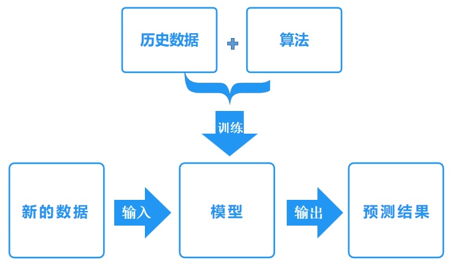
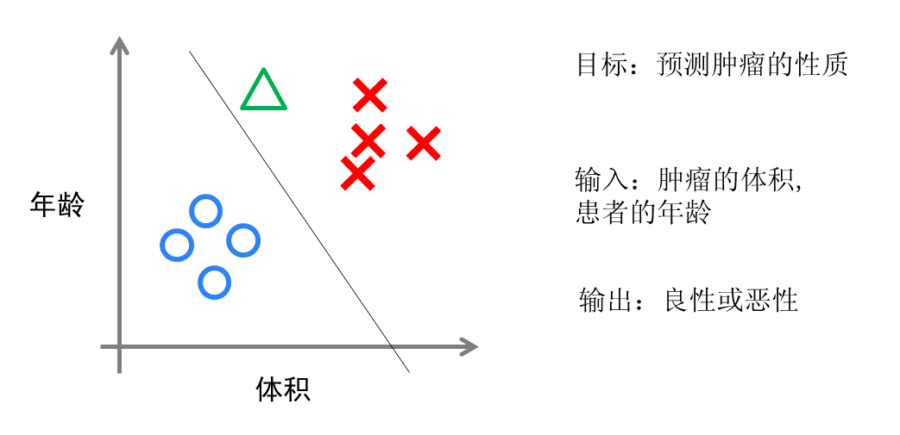
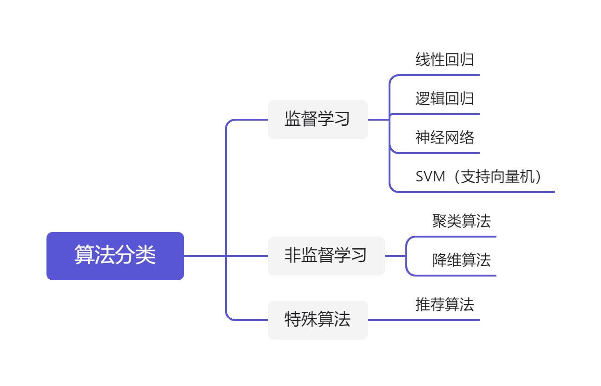

## 什么是机器学习
机器学习是把人类思考归纳的过程转化为计算机通过对数据的处理计算得出模型的过程。经过计算机得出的模型能够以近似于人的方式解决很多复杂的问题。

从广义上来说，机器学习通过赋予机器学习的能力，让其完成直接编程无法完成的功能。但从实践的意义上来说，机器学习是一种通过利用数据，训练模型，然后使用模型进行预测的一种方法。

人类在成长、生活过程中积累了很多历史经验（数据），然后对这些经验进行“归纳”，获得了“规律”（模型）。当遇到未知的问题或者需要对未来进行“推测”时，就会使用这些“规律”，对未知问题进行“推测”（预测），从而指导自己的生活和工作。

机器学习中的“训练”与“预测”过程，可以对应到人类的“归纳”和“推测”过程。通过这样的对应，我们发现机器学习的思想并不复杂，仅仅是对人类学习成长的一个模拟。由于机器学习不是基于编程形成的结果，因此它的处理过程不是因果的逻辑，而是通过归纳思想得出的相关性结论。

我们举个例子，支付宝春节的“集五福”活动，用手机扫“福”字照片自动识别福字。支付宝先给计算机提供大量“福”字的照片数据，通过算法模型训练，系统不断学习，然后输入一张新的福字照片，机器就能自动识别这张照片是否含有福字，这就是用了机器学习。

机器学习是一门多领域交叉学科，涉及概率论、统计学、逼近论、凸分析、算法复杂度理论、计算机科学等多门学科。机器学习的概念就是通过输入海量训练数据对模型进行训练，使模型掌握数据所蕴含的潜在规律，进而对新输入的数据进行准确的分类或预测。其过程如下图所示：

## 机器学习的场景
机器学习跟模式识别、统计学习、数据挖掘、计算机视觉、语音识别、自然语言处理等领域有着很深的联系。

从范围上来说，机器学习跟模式识别、统计学习、数据挖掘相类似。同时，机器学习与其他领域结合，形成了计算机视觉、语音识别、自然语言处理等多种交叉学科。因此，一般说数据挖掘，可以等同于说机器学习。同时，我们常说的机器学习应用的场景，是指通用场景，不局限在结构化数据，还有图像、音频等领域的应用。

下图是与机器学习相关的应用领域：

### 模式识别

**模式识别 = 机器学习**。

两者的主要区别在于前者是从工业界发展起来的概念，后者则源自计算机学科。在著名的《Pattern Recognition And Machine Learning》这本书中，Christopher M. Bishop在开头是这样说的“模式识别源自工业界，而机器学习来自于计算机学科。不过，它们中的活动可以被视为同一个领域的两个方面，同时在过去的10年间，它们都有了长足的发展”。

### 数据挖掘

**数据挖掘 = 机器学习+数据库**。

近些年，数据挖掘的概念实在过于火爆，几乎等同于炒作。但凡说数据挖掘都会吹嘘数据挖掘如何如何，例如从数据中挖出金子，以及将废弃的数据转化为价值等等。但是，尽管可能会挖出金子，但也可能挖到的是“石头”。这个说法的意思是，数据挖掘仅仅是一种思考方式，告诉我们应该尝试从数据中挖掘出知识，但不是每个数据都能挖掘出金子的，所以不要神话它。一个系统绝对不会因为上了一个数据挖掘模块就变得无所不能(这是IBM最喜欢吹嘘的)，恰恰相反，一个拥有数据挖掘思维的人员才是关键，而且他还必须对数据有深刻的认识，这样才可能从数据中导出模式指引业务的改善。大部分数据挖掘中的算法是机器学习的算法在数据库中的优化。

### 统计学习

**统计学习 ≈ 机器学习**。

统计学习是与机器学习高度重叠的学科。因为机器学习中的多数方法来自统计学，甚至可以认为，统计学的发展促进机器学习的繁荣。例如著名的[支持向量机算法][1]，就源自统计学科。但是在某种程度上两者是有分别的，这个分别在于：**统计学习者重点关注的是统计模型的发展与优化，偏数学，而机器学习者更关注的是能够解决问题，偏实践**。因此，机器学习人员会重点研究学习算法在计算机上执行的效率与准确性。

### 自然语言处理

**自然语言处理 = 机器学习+文本处理**。

自然语言处理技术，是让机器理解人类的语言的一门领域。在自然语言处理技术中，大量使用编译原理相关的技术，例如词法分析，语法分析等。除此之外，在理解这个层面，则使用了语义理解、机器学习等技术。作为唯一由人类自身创造的符号，自然语言处理一直是机器学习界不断研究的方向。按照百度机器学习专家余凯的说法“**听与看，说白了就是阿猫和阿狗都会的，而只有语言才是人类独有的**”。如何利用机器学习技术进行自然语言的深度理解，一直是工业和学术界关注的焦点。

### 计算机视觉

**计算机视觉 = 机器学习+图像处理**。

图像处理技术，将图像处理为适合机器学习模型中的输入。机器学习则负责从图像中识别出相关的模式。计算机视觉相关的应用非常的多，例如OCR识图、手写字符识别、车牌识别等等应用。这个领域是应用前景非常火热的，同时也是研究的热门方向。随着机器学习的新领域深度学习的发展，大大促进了计算机图像识别的效果，因此未来计算机视觉界的发展前景不可估量。

### 语音识别

**语音识别 = 机器学习+语音处理**。

语音识别就是音频处理技术与机器学习的结合。语音识别技术一般不会单独使用，一般会结合自然语言处理的相关技术。目前的相关应用有苹果的语音助手siri等。

## 机器学习的经典算法

通过上述介绍，我们知道了机器学习的应用场景，那机器学习有多少种经典算法呢？在这个部分我们简要介绍机器学习中的具有代表性的算法，重点介绍算法的思想，数学原理及实践细节不做讨论。

### （1）回归算法
在机器学习课程中，回归算法都是学习的第一个算法。原因有两个：①、回归算法比较简单，介绍它可以让我们平滑地从统计学迁移到机器学习中；②、回归算法是后面若干强大算法的基石，如果不理解回归算法，则无法学习那些强大的算法。回归算法有两个重要的子类：[线性回归][2]和[逻辑回归][3]。

线性回归是前面说过的房价求解问题。如何拟合出一条直线最佳匹配所有数据？一般使用“最小二乘法”求解。它的思想是这样的，假设我们拟合出的直线代表数据的真实值，而观测到的数据代表拥有误差的值，为了尽可能减小误差的影响，需要求解一条直线使所有误差的平方和最小。最小二乘法将最优问题转化为求函数极值问题。函数极值在数学上一般会采用求导数为0的方法。但这种做法并不适合计算机，因为计算机可能求解不出来，也可能计算量太大。

计算机科学界专门有一个学科叫**数值计算**，专门用来提升计算机计算时的准确度问题和效率问题。例如，著名的**梯度下降**以及**牛顿法**就是数值计算中的经典算法，非常适合来处理求解函数极值问题。梯度下降法是解决回归模型中最简单有效的方法之一。从严格意义上来说，后文中的神经网络和推荐算法中都有线性回归的因子，因此梯度下降法在后面的算法实现中也有应用。

逻辑回归与线性回归类似，但是，从本质上讲，两者处理的问题类型不一致。线性回归处理的是数值问题，最后预测出的结果是数字，例如房价。而逻辑回归属于分类算法，预测结果是离散的分类，例如判断邮件是否是垃圾邮件，以及用户是否会点击此广告等等。

实现方面的话，逻辑回归只是对线性回归的计算结果做了一次Sigmoid变换，将数值结果转化为了0~1之间的概率(Sigmoid函数的图像一般来说并不直观，我们只需要理解对数值越大，函数越逼近1，数值越小，函数越逼近0)。接着根据概率就可以做预测，例如概率大于0.5，则邮件是垃圾邮件，或者肿瘤是否是恶性等等。从直观上来说，逻辑回归是画出了一条分类线，见下图：

假设有一组肿瘤患者数据，有些肿瘤是良性的(图中的蓝色点)，有些是恶性的(图中的红色点)。这里肿瘤的红蓝色可以被称作数据的“标签”。同时每个数据包括两个“特征”：患者的年龄与肿瘤的大小。我们将两个特征与标签映射到二维空间上，形成了上图数据。

当我们有一个绿色点时，该判断肿瘤是恶性还是良性的呢？根据红蓝点我们训练出了一个逻辑回归模型，也就是图中的分类线。这时，根据绿点出现在分类线的左侧，因此判断它的标签是红色，也就是说属于恶性肿瘤。

逻辑回归算法划出的分类线基本都是线性的(也有划出非线性分类线的逻辑回归，不过那样的模型在处理数据量较大的时候效率很低)，这意味着当**两类之间的界线不是线性时，逻辑回归的表达能力就不足**。

下面要介绍的两个算法是机器学习领域最强大且最重要的算法，都可以拟合出非线性的分类线。

### （2）神经网络

神经网络(也称人工神经网络，ANN)算法是80年代机器学习界非常流行的算法，不过在90年代中途衰落。现在，携着“深度学习”之势，神经网络重装归来，重新成为最强大的机器学习算法之一。

神经网络的诞生起源于对大脑工作机理的研究。早期生物界学者们使用神经网络来模拟大脑。机器学习的学者们使用神经网络进行机器学习的实验，发现在视觉与语音的识别上效果都相当好。在BP算法(加速神经网络训练过程的数值算法)诞生以后，神经网络的发展进入了一个热潮。BP算法的发明人之一是机器学习大牛Geoffrey Hinton。

神经网络的学习原理是什么？

简单说，就是分解与整合。在著名的Hubel-Wiesel试验中，学者们研究猫的视觉分析机理是这样的。

比方说，一个正方形，分解为四个折线进入视觉处理的下一层中。四个神经元分别处理一个折线。每个折线再继续被分解为两条直线，每条直线再被分解为黑白两个面。于是，一个复杂的图像变成了大量的细节进入神经元，神经元处理以后再进行整合，最后得出了看到正方形的结论。这就是大脑视觉识别的机理，也是神经网络工作的机理。

让我们看一个简单的神经网络的逻辑架构。在这个网络中，分成输入层，隐藏层，和输出层。输入层负责接收信号，隐藏层负责对数据的分解与处理，最后的结果被整合到输出层。每层中的一个圆代表一个处理单元，可以认为是模拟了一个神经元，若干个处理单元组成了一个层，若干个层再组成了一个网络，也就是"神经网络"。

在神经网络中，每个处理单元事实上就是一个逻辑回归模型，逻辑回归模型接收上层的输入，把模型的预测结果作为输出传输到下一个层次。通过这样的过程，神经网络可以完成非常复杂的非线性分类。

下图演示了神经网络在图像识别领域的一个著名应用，这个程序叫做LeNet，是一个基于多个隐层构建的神经网络。通过LeNet可以识别多种手写数字，能达到很高的识别精度并拥有较好的**鲁棒性**。

右下方的方形中显示的是输入计算机的图像，方形上方的红色字样“answer”后面显示的是计算机的输出。左边的三条竖直的图像列显示的是神经网络中三个隐藏层的输出，可以看出，随着层次的不断深入，越深的层次处理的细节越低，例如层3基本处理的都已经是线的细节了。LeNet的发明人是机器学习领域的大牛Yann LeCun。

进入90年代，神经网络的发展进入了一个瓶颈期。其主要原因是尽管有BP算法的加速，神经网络的训练过程仍然很困难。因此90年代后期支持向量机(SVM)算法取代了神经网络的地位。

### （3）SVM（支持向量机）

支持向量机虽然诞生于统计学习领域，但在机器学习界大放光彩。

支持向量机算法从某种意义上来说是逻辑回归算法的强化：通过给予逻辑回归算法更严格的优化条件，支持向量机算法可以获得比逻辑回归更好的分类界线。但是如果没有核函数技术，支持向量机最多算是一种更好的线性分类技术。

但是，通过跟高斯“核”的结合，支持向量机可以表达出非常复杂的分类界线，从而达成很好的的分类效果。“核”事实上就是一种特殊的函数，最典型的特征就是可以将低维空间映射到高维空间。如下图所示：

如何在二维平面划分出一个圆形的分类界线？在二维平面会很困难。但是通过“核”可以将二维空间映射到三维空间，然后使用一个线性平面就可以达成类似效果。也就是说，二维平面划分出的非线性分类界线可以等价于三维平面的线性分类界线。于是，我们可以通过在三维空间中进行简单的线性划分，就可以达到在二维平面中的非线性划分效果。

　　
### （4）聚类算法

前面算法中，一个显著特征就是训练数据中包含标签，训练出的模型可以对其他未知数据预测标签。在下面的算法中，训练数据则不含标签，而算法的目的是通过训练，推测出这些数据的标签。这类算法有一个统称，即**无监督算法**(前面有标签的数据的算法则是有监督算法)。无监督算法中最典型的代表就是**聚类算法**。

我们还是拿一个二维数据来说，某一个数据包含两个特征，我们希望通过聚类算法，给他们中不同的种类打上标签，该怎么做呢？简单来说，聚类算法就是计算种群中的距离，根据距离的远近将数据划分为多个族群。

聚类算法中最典型的代表就是[K-Means算法][4]。

### （5）降维算法

降维算法也是一种无监督学习算法，其主要特征是将数据从高维降到低维。在这里，维度表示的是数据特征量的大小，例如，房价包含房子的长、宽、面积与房间数量四个特征，也就是4维数据。可以看出，长与宽与面积表示的信息重叠，因为面积=长×宽。通过降维算法可以去除冗余信息，将特征减少为面积与房间数量两个特征，即从4维数据压缩到2维。于是我们将数据从高维降低到低维，不仅利于表示，同时在计算上也能带来加速。

刚说的降维过程，减少的维度属于肉眼可视的层次，同时压缩也不会带来信息的损失(因为信息冗余了)。如果肉眼不可视，或者没有冗余的特征，降维算法也能工作，不过这样会带来一些信息损失。但是，降维算法可以从数学上证明，从高维压缩到低维中最大程度地保留了数据的信息。因此，使用降维算法仍然有很多好处。

降维算法的主要作用是，压缩数据与提升机器学习算法效率。通过降维算法，可以将具有几千个特征的数据压缩至若干个特征。另外，降维算法的另一个好处是数据可视化，例如将5维数据压缩至2维，然后可以用二维平面来可视。降维算法的主要代表是**PCA算法**(即主成分分析算法)。

### （6）推荐算法

推荐算法是目前非常火的一种算法，在电商，如亚马逊、天猫、京东等得到了广泛运用。推荐算法的主要特征是，可以自动向用户推荐他们感兴趣的东西，从而增加购买率，提升效益。推荐算法有两个主要类别：

**一类是基于物品内容的推荐**，将与用户购买物品近似的物品推荐给用户，这样的前提是每个物品都得有若干个标签，因此才可以找出与用户购买物品类似的物品，这样推荐的好处是关联程度较大，但是由于每个物品都需要贴标签，因此工作量较大。

**一类是基于用户相似度的推荐**，将与目标用户兴趣相同的其他用户购买的东西推荐给目标用户，例如小A历史上买了物品B和C，经过算法分析，发现另一个与小A近似的用户小D购买了物品E，于是将物品E推荐给小A。

两类推荐都有各自的优缺点，在一般电商应用中，通常是两类混合使用。推荐算法中最有名的算法是**协同过滤算法**。

### （7）其他

除了以上算法，机器学习领域还有其他算法，例如高斯判别、朴素贝叶斯、决策树等等算法。但上面列的六个算法使用最多，影响最广，种类最全。机器学习的一个特色就是算法众多，发展百花齐放。

### （8）经典算法总结

按照训练数据有无标签，可将算法分为监督学习和无监督学习，但推荐算法较为特殊，既不属于监督学习，也不属于非监督学习，归单独一类。如下图所示：

除了这些算法，还有一些算法在机器学习领域也经常出现。但他们本身并不算是一个机器学习算法，而是为了解决某个子问题而诞生的。我们可以理解为以上算法的子算法，用于大幅度提高训练过程。其中代表有：梯度下降法，主要运用在线型回归、逻辑回归、神经网络、推荐算法中，牛顿法，主要运用在线型回归中；BP算法，主要运用在神经网络中；SMO算法，主要运用在SVM中。

## 机器学习与大数据

说完机器学习算法，下面要谈一谈机器学习的应用。在2010年以前，机器学习的应用在某些特定领域发挥了巨大作用，如车牌识别、网络攻击防范、手写字符识别等等。但是，从2010年以后，随着大数据概念的兴起，机器学习大量的应用都与大数据高度耦合，几乎可以认为**大数据是机器学习应用的最佳场景**。

例如，但凡我们能找到介绍大数据的文章，都会说大数据如何准确预测到了某些事。例如Google的经典案例，利用大数据预测H1N1在美国某小镇的爆发。

百度预测2014年世界杯，从淘汰赛到决赛全部预测正确。

究竟是什么原因导致大数据具有这些魔力？简单来说，就是机器学习技术。正是基于机器学习技术的应用，数据才能发挥其能力。

**大数据的核心是挖掘数据价值，机器学习是挖掘数据价值的关键技术**。对于大数据而言，机器学习是不可或缺的。相反，对于机器学习而言，越多的数据会越可能提升模型的精确性，同时，复杂的机器学习算法的计算时间也迫切需要分布式计算与内存计算这样的关键技术。因此，机器学习的兴盛也离不开大数据的帮助。

大数据与机器学习两者互相促进，相依相存。

机器学习与大数据紧密联系。但是，必须清醒的认识到，大数据不等同于机器学习，同理，机器学习也不等同于大数据。大数据中包含有分布式计算、内存数据库、多维分析等等多种技术。单从分析方法来看，大数据也包含以下四种分析方法：

 1. 大数据，小分析：即数据仓库领域的OLAP分析思路，也就是多维分析思想。
 2. 大数据，大分析：这个代表的就是数据挖掘与机器学习分析法。
 3. 流式分析：这个主要指的是事件驱动架构。
 4. 查询分析：经典代表是NoSQL数据库。

也就是说，机器学习仅仅是大数据分析中的一种而已。尽管机器学习的一些结果具有很大的魔力，在某种场合下是大数据价值最好的说明。但这不代表机器学习是大数据唯一的分析方法。

机器学习与大数据的结合产生巨大的价值。基于机器学习技术的发展，数据能够“预测”。对人类而言，积累的经验越丰富，阅历也广泛，对未来的判断越准确。例如常说的经验丰富的人比初出茅庐的小伙子更有工作上的优势，就在于经验丰富的人获得的规律比他人更准确。而在机器学习领域，根据著名的一个实验，有效的证实了机器学习的一个理论：**即机器学习模型的数据越多，机器学习的预测的效率就越好**。见下图：

通过这张图可以看出，不同算法在输入的数据量达到一定级数后，都有相近的高准确度。于是诞生了机器学习界的名言：**成功的机器学习应用不是拥有最好的算法，而是拥有最多的数据**！

在大数据时代，有好多优势促使机器学习能够应用更广泛。例如随着物联网和移动设备的发展，我们拥有的数据越来越多，种类也包括图片、文本、视频等非结构化数据，这使得机器学习模型可以获得越来越多的数据。同时大数据技术中的分布式计算Map-Reduce使得机器学习的速度越来越快，可以更方便的使用。种种优势使得在大数据时代，机器学习的优势可以得到最佳的发挥。

## 机器学习与深度学习

近来，机器学习的发展产生了一个新的方向——**深度学习**。

虽然深度学习听起来颇为高大上，但其理念却非常简单，就是传统的神经网络发展到了多隐藏层的情况。

在上面介绍过，自90年代以后，神经网络消寂了一段时间。但是BP算法的发明人Geoffrey Hinton一直没有放弃对神经网络的研究。由于神经网络在隐藏层扩大到两个以上，其训练速度会非常慢，因此实用性一直低于支持向量机。2006年，Geoffrey Hinton在科学杂志《Science》上发表了一篇文章，论证了两个观点：

 1. 多隐层的神经网络具有优异的特征学习能力，学习得到的特征对数据有更本质的刻画，从而有利于可视化或分类；
 2. 深度神经网络在训练上的难度，可以通过**逐层初始化**来有效克服。

通过这样的发现，不仅解决了神经网络在计算上的难度，同时也说明了深层神经网络在学习上的优异性。从此，神经网络重新成为了机器学习界主流的学习技术。同时，具有多个隐藏层的神经网络被称为**深度神经网络**，基于深度神经网络的学习研究称之为**深度学习**。

由于深度学习的重要性，在各方面都取得极大关注，按照时间轴排序，有以下四个标志性事件值得一说：

- 2012年6月，《纽约时报》披露了Google Brain项目，这个项目由Andrew Ng和Map-Reduce发明人Jeff Dean共同主导，用16000个CPU Core的并行计算平台，训练一种称为“深层神经网络”的机器学习模型，在语音识别和图像识别等领域获得了巨大的成功。
- 2012年11月，微软在中国天津的一次活动上公开演示了一个全自动的同声传译系统，讲演者用英文演讲，后台的计算机一气呵成自动完成语音识别、英中机器翻译，以及中文语音合成，效果非常流畅，其中支撑的关键技术是深度学习；
- 2013年1月，在百度年会上，创始人兼CEO李彦宏高调宣布要成立百度研究院，其中第一个重点方向就是深度学习，并为此而成立深度学习研究院(IDL)。
- 2013年4月，《麻省理工学院技术评论》杂志将深度学习列为2013年十大突破性技术(Breakthrough Technology)之首。

目前业界许多图像识别技术与语音识别技术的进步都源于深度学习的发展，其中典型代表就是下图的百度识图功能。

深度学习属于机器学习的子类。基于深度学习的发展极大的促进了机器学习的地位提高，更进一步地推动了业界对机器学习的父类人工智能梦想的重视。

## 机器学习与人工智能

**人工智能是机器学习的父类**，深度学习则是机器学习的子类。如果把三者的关系用图来表明的话，则是下图：

毫无疑问，人工智能(AI)是人类所能想象的科技界最突破性的发明。从某种意义上说，人工智能就像游戏最终幻想的名字一样，是人类对于科技界的最终梦想。从50年代提出人工智能的理念以后，科技界，产业界在不断探索。甚至各种小说、电影都在以各种方式展现对于人工智能的想象。人类可以发明类似于人类的机器，这是多么伟大的理念！但事实上，自从50年代以后，人工智能的发展就磕磕碰碰，未有见到足够震撼的科学技术进步。

总结起来，人工智能的发展经历了如下若干阶段，从早期的逻辑推理，到中期的专家系统，这些科研进步确实使我们离机器的智能有点接近了，但还有一大段距离。直到机器学习诞生以后，人工智能界感觉终于找对了方向。基于机器学习的图像识别和语音识别在某些垂直领域达到了跟人相媲美的程度。机器学习使人类第一次如此接近人工智能的梦想。

事实上，如果我们把人工智能相关的技术以及其他业界的技术做一个类比，就可以发现机器学习在人工智能中的重要地位不是没有理由的。

人类区别于其他物体、植物、动物的最主要区别，我们认为是“智慧”。而智慧的最佳体现是什么？

- 是计算能力么，应该不是，心算速度快的人我们一般称之为天才。
- 是反应能力么，也不是，反应快的人我们称之为灵敏。
- 是记忆能力么，也不是，记忆好的人我们一般称之为过目不忘。
- 是推理能力么，这样的人我也许会称他智力很高，类似“福尔摩斯”，但不会称他拥有智慧。
- 是知识能力么，这样的人我们称之为博闻广，也不会称他拥有智慧。

想想看，我们一般形容谁有大智慧？圣人，诸如庄子、老子等。智慧是对生活的感悟，是对人生的积淀与思考，这与我们机器学习的思想何其相似？通过经验获取规律，指导人生与未来。没有经验就没有智慧。

机器学习与智慧的关系示意：

从计算机的角度来看，以上种种能力都有种种技术去应对。

例如计算能力我们有分布式计算，反应能力我们有事件驱动架构，检索能力我们有搜索引擎，知识存储能力我们有数据仓库，逻辑推理能力我们有专家系统，但是，唯有对应智慧中最显著特征的归纳与感悟能力，只有机器学习与之对应。这也是机器学习能力最能表征智慧的根本原因。

让我们再看一下机器人的制造，在我们具有了强大的计算，海量的存储，快速的检索，迅速的反应，优秀的逻辑推理后，如果再配合上一个强大的智慧大脑，一个真正意义上的人工智能也许就会诞生，这也是为什么说在机器学习快速发展的现在，人工智能可能不再是梦想的原因。

人工智能的发展可能不仅取决于机器学习，更取决于前面所介绍的深度学习，深度学习技术由于深度模拟了人类大脑的构成，在视觉识别与语音识别上显著性的突破了原有机器学习技术的界限，因此极有可能是真正实现人工智能梦想的关键技术。无论是谷歌大脑还是百度大脑，都是通过海量层次的深度学习网络所构成的。也许借助于深度学习技术，在不远的将来，一个具有人类智能的计算机真的有可能实现。

最后再说一下题外话，由于人工智能借助于深度学习技术的快速发展，已经在某些地方引起了传统技术界达人的担忧。真实世界的“钢铁侠”，特斯拉CEO马斯克就是其中之一。最近马斯克在参加MIT讨论会时，就表达了对于人工智能的担忧，“人工智能的研究就类似于召唤恶魔，我们必须在某些地方加强注意。”
 
尽管马斯克的担心有些危言耸听，但是马斯克的推理不无道理。“如果人工智能想要消除垃圾邮件的话，可能它最后的决定就是消灭人类。”马斯克认为预防此类现象的方法是引入政府的监管。在这里作者的观点与马斯克类似，在人工智能诞生之初就给其加上若干规则限制可能有效，也就是不应该使用单纯的机器学习，而应该是机器学习与规则引擎等系统的综合能够较好的解决这类问题。因为如果学习没有限制，极有可能进入某个误区，必须要加上某些引导。正如人类社会中，法律就是一个最好的规则，杀人者死就是对于人类在探索提高生产力时不可逾越的界限。

在这里，必须提一下这里的规则与机器学习引出的规律不同，规律不是一个严格意义的准则，其代表的更多是概率上的指导，而规则是神圣不可侵犯，不可修改的。规律可以调整，但规则不能改变。有效的结合规律与规则的特点，可以引导出一个合理的、可控的学习型人工智能。

## 总结

机器学习是目前业界最为Amazing与火热的一项技术，从网上的每一次淘宝的购买东西，到自动驾驶汽车技术，以及网络攻击抵御系统等等，都有机器学习的因子在内，同时机器学习也是最有可能使人类完成AI dream的一项技术，各种人工智能目前的应用，如微软小冰聊天机器人，到计算机视觉技术的进步，都有机器学习努力的成分。作为一名当代的计算机领域的开发或管理人员，以及身处这个世界，使用者IT技术带来便利的人们，最好都应该了解一些机器学习的相关知识与概念，因为这可以帮你更好的理解为你带来莫大便利技术的背后原理，以及让你更好的理解当代科技的进程。

----

> 原文地址：[计算机的潜意识@博客园][5]

  [1]: https://github.com/likuli/data-analysis-learning/blob/main/docs/analysis_ai/svm.md
  [2]: https://github.com/likuli/data-analysis-learning/blob/main/docs/analysis_ai/linear_regression.md
  [3]: https://github.com/likuli/data-analysis-learning/blob/main/docs/analysis_ai/logistic_regression.md
  [4]: https://github.com/likuli/data-analysis-learning/blob/main/docs/analysis_ai/kmeans_algorithm.md
  [5]: https://www.cnblogs.com/subconscious/p/4107357.html