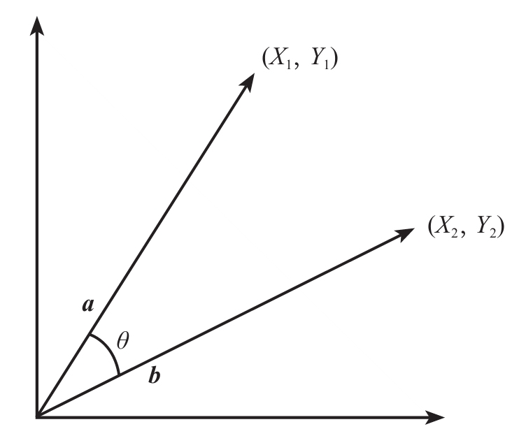

在文本处理中，经常需要判断两个文本是否相似，比如，基于聚类算法发现微博热点话题，需要度量各篇文本的内容相似度，然后让足够相似的微博聚成一个簇，在对语料预处理时，需要基于文本相似度，删除重复文本。总之，文本相似度是一种常用工具，可以帮助我们解决很多问题。

下表是3个用户对3种物品的评分，5表示五星评级，以此类推。

|  &nbsp;   | 用户1 | 用户2 | 用户3| 
|---| ---- | ---   | ---- | 
| 物品A | 5 | 1 | 5 |
| 物品B | 4 | 2 | 2 |
| 物品C | 4 | 2 | 1 |

因为表中的评分数据都在0～5之间，量级一致，所以无须做标准化处理。如果数据的量级存在较大差异，应先做标准化处理。

下面使用该数据介绍几种计算相似度的方法。

## 欧式距离

在空间几何中，如果A点坐标为 $(X_1, X_2, X_3)$ ，B点坐标为 $(Y_1, Y_2, Y_3)$ ，则A点与B点间的欧氏距离计算公式如下：

$$d(A, B) = \sqrt{(X_1-Y_2)^2+(X_2-Y_2)^2+(X_3-Y_3)^2}$$

该公式同样可以衡量物品A和物品B之间的距离。d（A，B）代表物品A和物品B间的欧氏距离， $X_1/ X_2/ X_3$ 分别代表用户1、用户2、用户3对物品A的评分， $Y_1/ Y_2/ Y_3$ 分别代表用户1、用户2、用户3对物品B的评分。d（A，B）越小，说明两者越接近，也就意味着两者越相似。

将前面的用户评分表中的数据代入公式，计算物品A和物品B的欧氏距离为：

$$d(A, B) = \sqrt{(5-4)^2+(1-2)^2+(5-2)^2}=\sqrt{11}=3.32$$

除了直接比较欧氏距离，还可以利用欧氏距离衍生出的相似度公式来衡量两者的相似度。基于欧氏距离的相似度sim（A，B）定义如下：

$$sim(A, B) = \frac {1}{1+d(A, B)}$$

由公式可知，两物品间的欧氏距离越小，则相似度越大，两物品越相近。

将前面计算出的欧氏距离代入公式，计算物品A和物品B的相似度为：

$$sim(A, B) = \frac {1}{1+3.32} = 0.23$$

对前面的用户评分表分别计算欧氏距离和相似度，结果见下表：

| &nbsp; | 欧氏距离 | 相似度 |
| --- | ---- | ---- |
|物品A和B| 3.32 |  0.23 |
|物品A和C| 4.24 |  0.19 |
|物品B和C| 1.00 |  0.50 |

物品B和C的欧氏距离最小，相似度最大，可以认为在这3种物品中，物品B和C最为相似，喜欢物品B的用户有较大的可能也喜欢物品C，因此可以向购买了物品B的用户推荐物品C，向购买了物品C的用户推荐物品B。

## 余弦相似度

在二维向量空间下可以使用两个向量夹角（θ）的余弦值（cosθ）来表示两个向量的相似度，称为**余弦相似度**。余弦相似度的取值范围为0～1，夹角越小，余弦值越接近1，则两个向量越靠近，说明它们越相似。如下图所示：

向量 $a＝(X_1, Y_1)$ ，向量 $b＝(X_2, Y_2)$ ，通过改写三角形余弦公式可以得到：

$$cos\theta = \frac{a·b}{|a||b|}$$

其中表示向量a乘向量b，|a|表示向量a的模，|b|表示向量b的模，代入坐标可得：

$$cos\theta = \frac{X_1X_2+Y_1Y_2}{\sqrt{X_1^2+Y_1^2}\times\sqrt{X_2^2+Y_2^2}}$$

将其推广至n维向量空间，若向量 $a＝(X_1, X_2, X_3, ..., X_n)$ ，向量 $b＝(Y_1, Y_2, Y_3, ..., Y_n)$ ，则向量a和向量b的夹角的余弦值可以表示为：

$$cos\theta = \frac{X_1X_2+Y_1Y_2+X_3Y_3+...+X_nY_n}{\sqrt{X_1^2+X_2^2+X_3^2+...+X_n^2}\times\sqrt{Y_1^2+Y_2^2+Y_3^2+...+Y_n^2}}$$

如果向量a和向量b的余弦相似度为1，即两个向量的夹角为0，说明两个文本十分相似，反之亦然。

根据上述用户评分表，物品A对应的向量a为（5，1，5），物品B对应的向量b为（4，2，2），物品C对应的向量c为（4，2，1）。以向量a和向量b为例，带入上述公式：

$$cos\theta = \frac{5\times4+1\times2+5\times2}{\sqrt{5^2+1^2+5^2}\times\sqrt{4^2+2^2+2^2}}=0.91$$

向量a和向量b的余弦相似度为0.91，说明物品A和物品B十分相似。

对a、b、c三个向量，两两计算，结果如下：

| &nbsp; | 余弦相似度 |
| --- | ---- |
|物品A和B| 0.91 |  
|物品A和C| 0.82 |  
|物品B和C| 0.97 |  

可以看到，物品B和C的余弦相似度最大，约为0.97。

## 皮尔逊相关系数

皮尔逊相关系数r，是用于描述两个变量间**线性相关**强弱程度的统计量，取值范围为[-1，1]，正值代表两个变量存在正线性相关，负值代表两个变量存在负线性相关。r的绝对值越大，代表相关性越强。计算公式如下：

$$r_{XY}=\frac{COV(X,Y)}{\sqrt{D(X)}\sqrt{D(Y)}}=\frac{E((X-EX)(Y-EY))}{\sqrt{D(X)}\sqrt{D(Y)}}$$

与之对应的距离公式为：

$$D_{XY} = 1-r_{XY}$$

COV（X，Y）为变量X和Y的协方差，D（X）和D（Y）分别为变量X和Y的方差。使用皮尔逊相关系数度量物品间的相似度时，皮尔逊相关系数的绝对值越大，两个物品的线性相关程度越强，两者越相似。

通常以下面的取值范围判断变量的相关强度：

| 范围 | 程度 |
| --- | ---- |
|0.8~1.0| 极强相关|
|0.6~0.8| 强相关|
|0.4~0.6| 一般相关|
|0.2~0.4| 弱相关|
|0.0~0.2| 无相关或极弱相关|

通过Python的Scipy库中的pearsonr()函数可以方便的计算出向量之间的皮尔逊相关系数，这里不做具体推导。其结果如下：

| &nbsp; | 皮尔逊相关系数 |
| --- | ---- |
|物品A和B| 0.50 |  
|物品A和C| 0.19 |  
|物品B和C| 0.94 |  

可以看出，物品B和C的r值的绝对值最大，约为0.94，因此可以认为表中的所有物品中它们最相似，这与使用欧氏距离和余弦相似度度量物品相似度得出的结论一致。

----

> *参考资料：*
> 
> [《Python大数据分析与机器学习商业案例实战》][1]

  [1]: https://book.douban.com/subject/35105377/