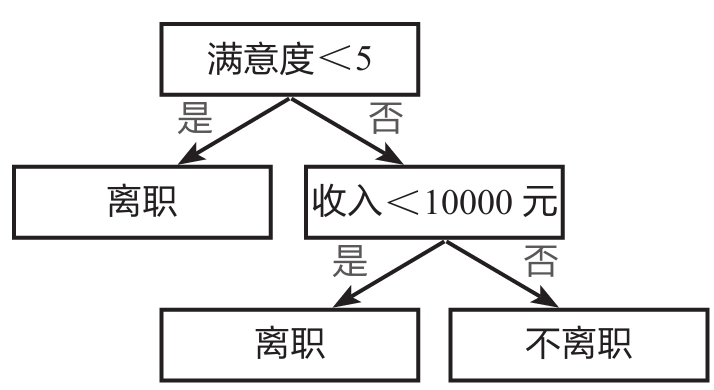
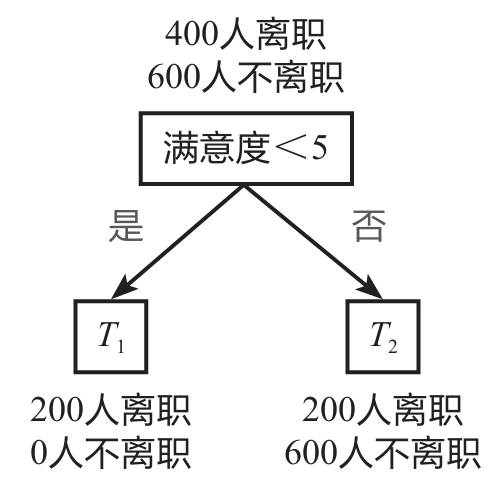
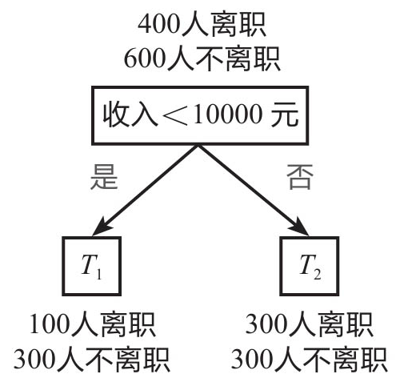

## 决策树的基本原理

决策树模型是机器学习的各种算法模型中比较好理解的一种模型，它的基本原理是对一系列问题进行if/else的推导，最终实现相关决策。

下图所示为一个典型的决策树模型——员工离职预测模型的简单演示。

该决策树首先判断员工满意度是否小于5，若答案为“是”，则认为该员工会离职，若答案为“否”，则接着判断该员工收入是否小于10000元，若答案为“是”，则认为该员工会离职，若答案为“否”，则认为该员工不会离职。

上图所示即决策树模型的核心原理，之后要讲解的员工离职预测模型是基于大数据搭建的一个稍复杂的模型。商业实战中不会仅根据“满意度”和“收入”两个特征来判断是否离职，而是根据多个特征来预测离职概率，再根据相应的阈值来判断是否离职，例如，离职概率超过50%即认为该员工会离职。

下面解释决策树模型的几个重要概念：父节点和子节点、根节点和叶子节点。

父节点和子节点是相对的，子节点由父节点根据某一规则分裂而来，然后子节点作为新的父节点继续分裂，直至不能分裂为止。根节点则和叶子节点是相对的，根节点是没有父节点的节点，即初始节点，叶子节点则是没有子节点的节点，即最终节点。决策树模型的关键就是**如何选择合适的节点进行分裂**。

在上图中，“满意度＜5”是根节点，同时也是父节点，分裂成两个子节点“离职”和“收入＜10000元”；子节点“离职”因为不再分裂出子节点，所以又是叶子节点；另一个子节点“收入＜10000元”又是其下面两个节点的父节点；“离职”及“不离职”则为叶子节点。

在实际应用中，企业会通过已有的数据来分析离职员工都符合何种特征，如查看他们的满意度、收入、工龄、月工时、项目数等，然后选择相应的特征进行节点分裂，便能搭建出类似上面的决策树模型，再利用该模型预测员工离职情况，并根据预测结果采取应对措施。

决策树的概念并不复杂，主要是**通过连续的逻辑判断得出最后的结论**，其关键在于如何建立这样一棵“树”。例如，根节点应该选择哪一个特征，选择“满意度＜5”或选择“收入＜10000元”作为根节点，会收到不同的效果。其次，收入是一个连续变量，选择“收入＜10000元”或选择“收入＜100000元”作为一个节点，其结果也是有区别的。

## 决策树的建树依据

决策树模型的建树依据主要用到的是**基尼系数**的概念。基尼系数（gini）用于计算一个系统中的失序现象，即系统的混乱程度。基尼系数越高，系统的混乱程度就越高，建立决策树模型的目的就是降低系统的混乱程度，从而得到合适的数据分类效果。基尼系数的计算公式：

$$gini(T) = 1 - \sum{p}^{2}_{i}$$

其中pi为类别i在样本T中出现的频率，即类别为i的样本占总样本个数的比率；Σ为求和符号，即对所有的进行求和。

例如，一个全部都是离职员工的样本中只有一个类别——离职员工，其出现的频率是100%，所以该系统的基尼系数为 $1-1^2=0$ ，表示该系统没有混乱，或者说该系统的“纯度”很高。而如果样本中一半是离职员工，另一半是未离职员工，那么类别个数为2，每个类别出现的频率都为50%，所以其基尼系数为 $1-(0.5^2 + 0.5^2) = 0.5$ ，即其混乱程度很高。

当引入某个用于分类的变量（如“满意度＜5”）时，分类后的基尼系数公式：

$$gini(T) = \frac{S_1}{S_1+S_2}gini(T_1)+\frac{S_2}{S_1+S_2}gini(T_2)$$

其中S1、S2为划分后的两类各自的样本量，gini（T1）、gini（T2）为两类各自的基尼系数。

例如，一个初始样本中有1000个员工，其中已知有400人离职，600人不离职。划分前该系统的基尼系数为1-（0.42＋0.62）＝0.48，下面采用两种方式决定根节点：一是根据“满意度＜5”进行分类；二是根据“收入＜10000元”进行分类。

**划分方式1：** 以“满意度＜5”为根节点进行划分，如下图所示，划分后的基尼系数为0.3，计算过程如下：

$T_1$ 的基尼系数： $gini(T_1) = 1 - (1^2 + 0^2) = 0$

$T_2$ 的基尼系数： $gini(T_2) = 1 - ({0.25}^2 + {0.75}^2 = 0.375$

划分后的基尼系数：

$$
gini(T) = \frac{200+0}{200+0+200+600} \times 0 + \frac{200+600}{200+0+200+600} \times 0.375 = 0.3
$$

**划分方式2：** 以“收入＜10000元”为根节点进行划分，如下图所示，划分后的基尼系数为0.45，计算过程如下：

$T_1$ 的基尼系数： $gini(T_1) = 1 - (0.25^2 + 0.75^2) = 0.375$

$T_2$ 的基尼系数： $gini(T_2) = 1 - ({0.5}^2 + {0.5}^2 = 0.5$

划分后的基尼系数：

$$
gini(T) = \frac{100+300}{100+300+300+300} \times 0.375 + \frac{300+300}{100+300+300+300} \times 0.5 = 0.45
$$

可以看到，划分前的基尼系数为0.48，以“满意度＜5”为根节点进行划分后的基尼系数为0.3，而以“收入＜10000元”为根节点进行划分后的基尼系数为0.45。**基尼系数越低表示系统的混乱程度越低，区分度越高，越适合用于分类预测**，因此这里选择“满意度＜5”作为根节点。

上面演示了如何利用基尼系数来选择根节点，根节点下面的节点也是用类似方法来选择。例如，对于变量“收入”来说，是选择“收入＜10000元”还是选择“收入＜100000元”作为划分依据，同样通过计算这两种情况下划分后的基尼系数来进行判断。若还有其他变量，如工龄、月工时等，也是通过类似方法计算划分后的基尼系数，再根据基尼系数判断如何划分节点，从而搭建出一个较为完善的决策树模型。

采用基尼系数进行运算的决策树也称为**CART决策树**。

### 信息熵

除了基尼系数，还有一种衡量系统混乱程度的经典手段——信息熵。

在搭建决策树模型时，信息熵的作用和基尼系数是基本一致的，都可以帮助我们合理地划分节点。信息熵H（X）的计算公式如下：

$$ H(X) = -\sum{p}_i{log}_2(p_i) $$

其中X表示随机变量，随机变量的取值为 $X_1、X_2、X_3...$ ，在n分类问题中便有n个取值，例如，在员工离职预测模型中，X的取值就是“离职”与“不离职”两种； $p_i$ 表示随机变量X取值为 $X_i$ 的发生频率，且有 $\sum{p}_i = 1$ 。需要注意的是，公式中的对数函数是以2为底的。

举例来说，一个全部都是离职员工的样本中只有一个类别——离职员工，其出现的频率是100%，所以该系统的信息熵为 $-1×log_21＝0$ ，表示该系统没有混乱。而如果样本中一半是离职员工，另一半是未离职员工，那么类别个数为2，每个类别出现的频率都为50%，所以该系统的信息熵为 $-(0.5 \times {log}_2{0.5}+0.5 \times {log}_2{0.5}) = 1$ ，表示该系统混乱程度很高。

当引入某个用于进行分类的变量A（如“满意度＜5”），则根据变量A划分后的信息熵又称为条件熵，其计算公式如下：

$$
H_A(X)= \frac{S_1}{S_1+S_2}H(X_1) + \frac{S_2}{S_1+S_2}H(X_2)
$$

其中 $S_1、S_2$ 为划分后的两类各自的样本量， $H(X_1)、H(X_2)$ 为两类各自的信息熵。

为了衡量不同划分方式降低信息熵的效果，还需要计算分类后信息熵的减少值（原系统的信息熵与分类后系统的信息熵之差），该**减少值称为熵增益或信息增益，其值越大，说明分类后的系统混乱程度越低**，即分类越准确。信息增益的计算公式如下：

$$Gain(A) = H(X) - H_A(X)$$

继续用前面讲解基尼系数时的例子来讲解信息熵的应用。初始样本有1000个员工，其中已知有400人离职，600人不离职。划分前该系统的信息熵为 $-(0.4×log_20.4＋0.6×log_20.6)＝0.97$ ，混乱程度较高。下面采用两种方式决定根节点：一是根据“满意度＜5”进行分类；二是根据“收入＜10000元”进行分类。

**划分方式1：** 以“满意度＜5”为根节点进行划分，如下图所示，划分后的信息熵为0.65，信息增益为0.32，计算过程如下：

初始信息熵： $H(X) = - (0.4\times{log}_2{0.4}+0.6\times{log}_2{0.6}) = 0.97$

$X_1$ 的信息熵：$H(X_1) = -(1\times{log}_2{1} + 0\times{log}_2{0}) = 0$

$X_2$ 的信息熵： $H(X_2) = - (0.25\times{log}_2{0.25} + 0.75\times{log}_2{0.75}) = 0.81$

划分后的信息熵：

$$
H_A(X) = \frac{200+0}{200+0+200+600} \times 0 + \frac{200+600}{200+0+200+600}\times 0.81 = 0.65
$$

信息增益：

$$Gain(A) = H(X) - H_A(X) = 0.97 - 0.65 = 0.32$$

**划分方式2：** 以“收入＜10000元”为根节点进行划分，如下图所示，划分后的信息熵为0.924，信息增益为0.046，计算过程如下：

初始信息熵： $H(X) = - (0.4\times{log}_2{0.4}+0.6\times{log}_2{0.6}) = 0.97$

$X_1$ 的信息熵：$H(X_1) = -(0.25\times{log}_2{0.25} + 0.75\times{log}_2{0.75}) = 0.81$

$X_2$ 的信息熵： $H(X_2) = - (0.5\times{log}_2{0.5} + 0.5\times{log}_2{0.5}) = 1$

划分后的信息熵：

$$
H_A(X) = \frac{100+300}{100+300+300+300} \times 0 + \frac{300+300}{100+300+300+300}\times 0.81 = 0.924
$$

信息增益：

$$Gain(B) = H(X) - H_B(X) = 0.97 - 0.924 = 0.046$$

根据方式1划分后的信息增益为0.32，大于根据方式2划分后的信息增益0.046，因此选择根据方式1进行决策树的划分，这样能更好地降低系统的混乱程度。这个结论和之前用基尼系数计算得到的结论是一样的。

基尼系数涉及平方运算，而信息熵涉及相对复杂的对数函数运算，因此，目前**决策树模型默认使用基尼系数作为建树依据，运算速度会较快**。

商业实战中的数据量通常很大，不同情况下的基尼系数或信息熵的计算是人力难以完成的，因此需要利用机器不停地训练来找到最佳的分裂节点。在Python中，可以用Scikit-Learn库来快速建立一个决策树模型。

