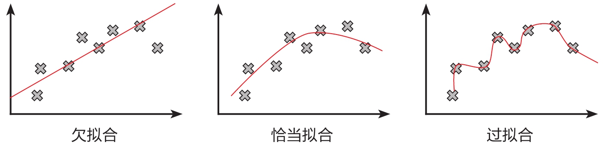

## 概述
过拟合即过度拟合，指模型在训练样本中拟合程度过高，虽然它很好地贴合了训练集数据，但是丧失了泛化能力，不具有推广性，也就是说，如果换了训练集以外的数据就达不到较好的预测效果。与过拟合相对应的概念是欠拟合，欠拟合是指模型拟合程度不高，数据距离拟合曲线较远，或指模型没有很好地捕捉到数据特征，不能很好地拟合数据。

## 过拟合
### 常见产生过拟合的原因
（1）建模样本选取有误，如**样本数量太少，选样方法错误，样本标签**错误等，导致选取的样本数据不足以代表预定的分类规则；

（2）样本噪音干扰过大，使得机器将部分噪音认为是特征从而扰乱了预设的分类规则；

（3）假设的模型无法合理存在，或者说是假设成立的条件实际并不成立；

（4）**参数太多**，模型复杂度过高；

（5）对于决策树模型，如果我们对于其生长没有合理的限制，其自由生长有可能使节点只包含单纯的事件数据(event)或非事件数据(no event)，使其虽然可以完美匹配（拟合）训练数据，但是无法适应其他数据集。

（6）对于神经网络模型：a)对样本数据可能存在分类决策面不唯一，随着学习的进行，BP算法使权值可能收敛过于复杂的决策面；b)权值学习迭代次数足够多(Overtraining)，拟合了训练数据中的噪声和训练样例中没有代表性的特征。

### 常用的解决方法
（1）在神经网络模型中，可使用权值衰减的方法，即每次迭代过程中以某个小因子降低每个权值。

（2）选取合适的停止训练标准，使对机器的训练在合适的程度；

（3）保留验证数据集，对训练成果进行验证；

（4）获取额外数据进行交叉验证；

（5）正则化，即在进行目标函数或代价函数优化时，在目标函数或代价函数后面加上一个正则项，一般有L1正则与L2正则等。

## 欠拟合

通常产生欠拟合的原因有：**模型复杂度过低**和**特征量过少**。

常见的解决方法：

（1）增加新特征，可以考虑加入进特征组合、高次特征，来增大假设空间；

（2）添加多项式特征，这个在机器学习算法里面用的很普遍，例如将线性模型通过添加二次项或者三次项使模型泛化能力更强；

（3）减少正则化参数，正则化的目的是用来防止过拟合的，但是模型出现了欠拟合，则需要减少正则化参数；

（4）使用非线性模型，比如核SVM 、决策树、深度学习等模型；

（5）调整模型的容量(capacity)，通俗地，模型的容量是指其拟合各种函数的能力；

（6）容量低的模型可能很难拟合训练集；使用集成学习方法，如Bagging ,将多个弱学习器Bagging。

## 补充知识点
### 泛化能力
泛化能力（generalization ability）是指机器学习算法对新鲜样本的适应能力。学习的目的是学到隐含在数据背后的规律，对具有同一规律的学习集以外的数据，经过训练的网络也能给出合适的输出，该能力称为泛化能力。通常期望经训练样本训练的模型具有较强的泛化能力，也就是对新输入给出合理响应的能力。应当指出并非训练的次数越多越能得到正确的输入输出映射关系。模型的性能主要用它的泛化能力来衡量。

---

> *参考资料：*
> 
> - [《Python大数据分析与机器学习商业案例实战》][1]
> - [欠拟合 - 百科][2]
> - [过拟合 - 百科][3]

  [1]: https://book.douban.com/subject/35105377/
  [2]: https://baike.baidu.com/item/%E6%AC%A0%E6%8B%9F%E5%90%88/22692155?fr=aladdin
  [3]: https://baike.baidu.com/item/%E8%BF%87%E6%8B%9F%E5%90%88/3359778?fr=aladdin