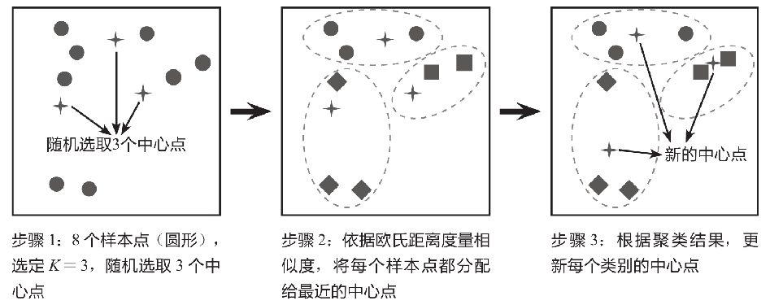
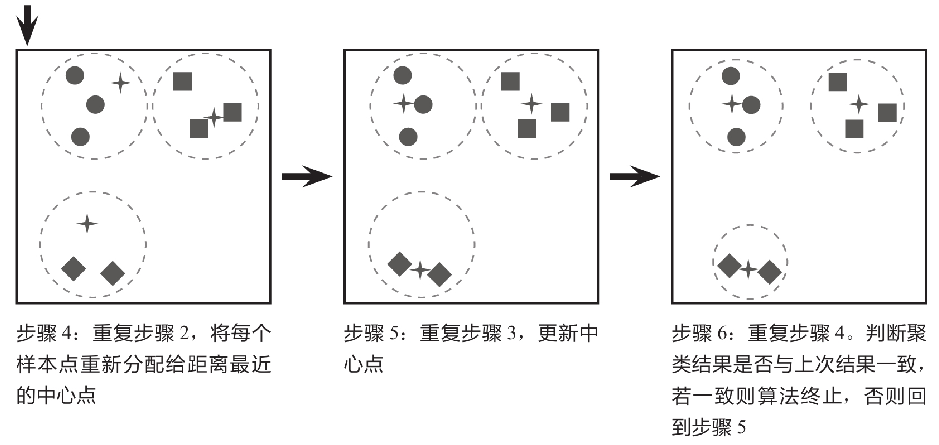

K-Means算法是最常用的一种**聚类算法**。

算法名称中的K代表类别数量，Means代表每个类别内样本的均值，所以KMeans算法又称为K-均值算法。

KMeans算法以距离作为样本间相似度的度量标准，将距离相近的样本分配至同一个类别。样本间距离的计算方式可以是欧氏距离、曼哈顿距离、余弦相似度等，KMeans算法通常采用**欧氏距离**来度量各样本间的距离。

KMeans算法的核心思想是对每个样本点计算到各个中心点的距离，并将该样本点分配给距离最近的中心点代表的类别，一次迭代完成后，根据聚类结果更新每个类别的中心点，然后重复之前操作再次迭代，直到前后两次分类结果没有差别。如下图所示的简单案例解释了KMeans算法的原理，该案例的目的是将8个样本点聚成3个类别（K＝3）。

