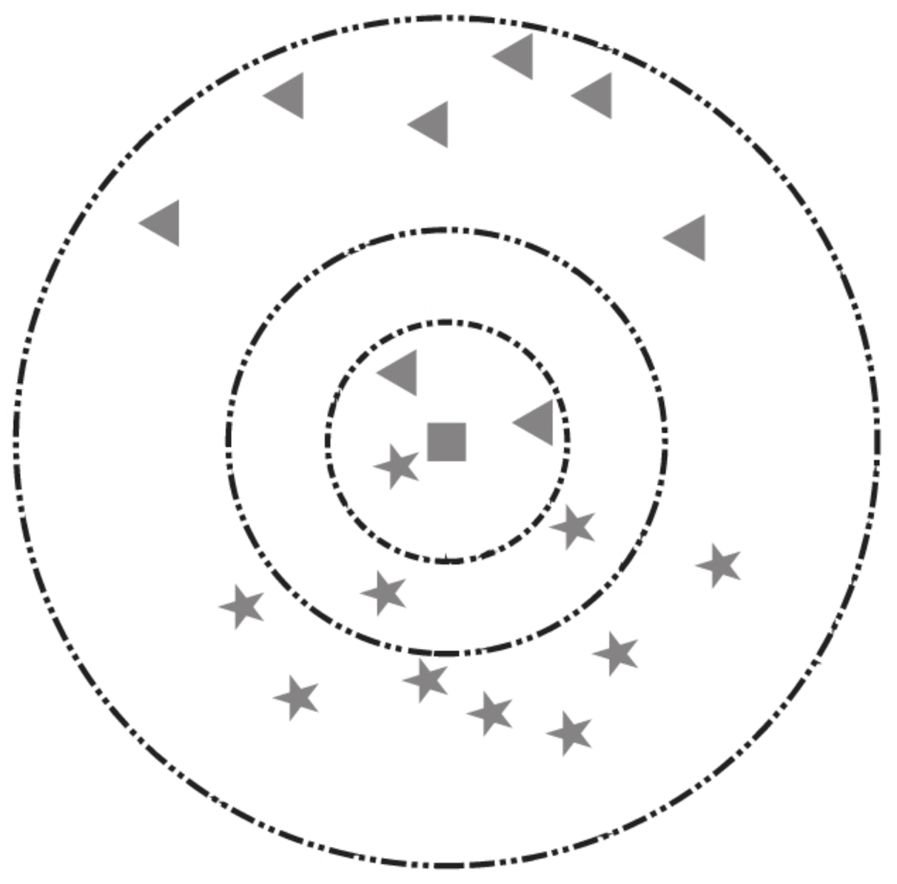
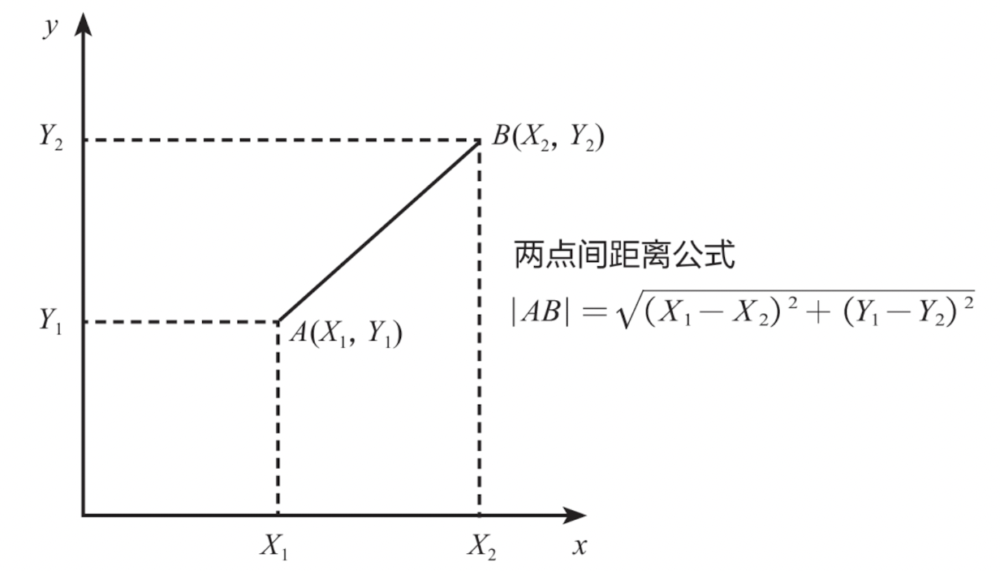
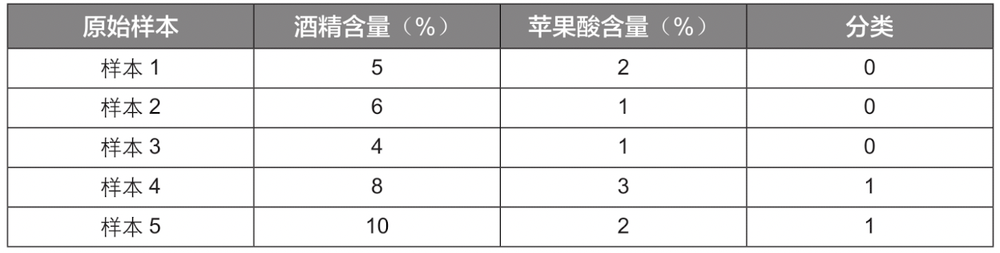
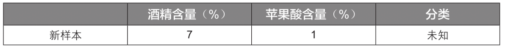
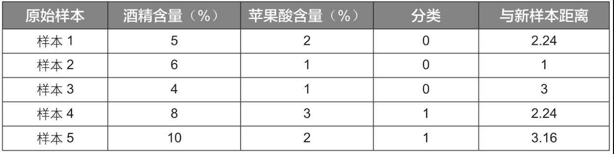
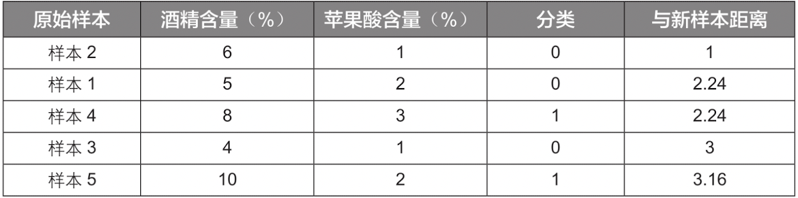

K近邻算法，简称KNN算法，是非常经典的机器学习算法。

## K近邻算法的基本原理

K近邻算法就是在已有数据中寻找与它最相似的K个数据，或者说“离它最近”的K个数据。如果这K个数据多数属于某个类别，则该样本也属于这个类别。

以下图为例，假设五角星代表爱情片，三角形代表科幻片。此时加入一个新样本正方形，需要判断其类别。当选择以离新样本最近的3个近邻点(K=3)为判断依据时，这3个点由1个五角星和2个三角形组成，根据“少数服从多数”原则，可以认为新样本属于三角形的类别，即新样本是一部科幻片。同理，当选择离新样本最近的5个近邻点(K=5)为判断依据时，这5个点由3个五角星和2个三角形组成，根据“少数服从多数”原则，可以认为新样本属于五角星的类别，即新样本是一部爱情片。

明白了K的含义后，下面来学习如何判断2个数据的相似度，或者说2个数据的距离。这里采用最为常见的欧氏距离来定义向量空间内2个点的距离，对于二维空间而言，样本A的2个特征值为 $(X_1, Y_1)$ ，样本B的2个特征值为 $(X_2, Y_2)$ ，那么2个样本的距离计算公式如下：

$$|AB| = \sqrt[]{(X_1-X_2)^2+(Y_1-Y_2)^2}$$

这个其实就是常见的两点间距离公式，如下图所示，其适用于只有2个特征变量的情况。

实际应用中，数据的特征通常有n个，此时可将该距离公式推广到n维空间，如n维向量空间内A点坐标为 $(X_1,X_2,X_3,...,X_n)$ ，B点坐标为 $(Y_1,Y_2,Y_3,...,Y_n)$ ，那么A、B两点间的欧氏距离计算公式如下：

$$|AB| = \sqrt[]{(X_1-Y_1)^2+(X_2-Y_2)^2+(X_3-Y_3)^2+...+(X_n-Y_n)^2}$$

## K近邻算法的计算步骤

这里通过一个简单的例子“如何判断葡萄酒的种类”来讲解K近邻算法的计算步骤。商业实战中用于评判葡萄酒的指标有很多，为方便演示，这里只根据“酒精含量”和“苹果酸含量”2个特征变量将葡萄酒分为2类，并且原始样本数据只有5组，见下表：

其中“酒精含量”代表葡萄酒中酒精的含量，“苹果酸含量”代表葡萄酒中苹果酸的含量，“分类”取值为0代表葡萄酒A，取值为1代表葡萄酒B。

现在需要使用K近邻算法对一个新样本进行分类，该新样本的特征数据见下表，那么这个新样本是属于葡萄酒A还是葡萄酒B呢?

此时可以利用距离公式来计算新样本与已有样本之间的距离，即不同样本间的相似度。例如，新样本与样本1的距离计算公式如下：

$$|AB| = \sqrt[]{(5-7)^2+(2-1)^2} = 2.24$$

同理可以计算新样本与其他原始样本的距离，结果如下：

计算出各个原始样本与新样本的距离后，再根据距离由近及远排序，结果如下：

如果令K值等于1，也就是以离新样本最近的原始样本的种类作为新样本的种类，此时新样本离样本2最近，则新样本的分类为0，也就是葡萄酒A。

如果令K值等于3，也就是以离新样本最近的3个原始样本的多数样本的种类为判断依据，此时最近的3个原始样本是样本2、样本1、样本4，它们中以分类0居多，所以判定新样本的分类为0，也就是葡萄酒A。

### 数据标准化

上述演示数据中，不同特征变量的量纲级别相差不大，如果把“酒精含量”数据都放大为原来的10倍，“苹果酸含量”数据保持不变，那么两者的量纲级别就相差较大了，见下表：

[图6]

此时如果直接使用K近邻算法来搭建模型，那么“酒精含量”在模型中的重要性将远远超过“苹果酸含量”的重要性，这样会丧失“苹果酸含量”这一特征变量的作用，而且结果也会有较大误差。举例来说，对于一个新样本，其“酒精含量”为70%，“苹果酸含量”为1%，此时它与样本1的距离计算如下：

$$|AB| = \sqrt[]{(50-70)^2+(2-1)^2} = 20.02$$

可以看到，此时的距离几乎就是由“酒精含量”主导，“苹果酸含量”由于量纲级别相差较大，几乎不发挥作用，如果不进行数据预处理，会导致预测结果有失偏颇。

因此，如果不同特征变量的量纲级别相差较大且在建模时相互影响，我们通常会对数据进行预处理，该手段称为**数据标准化或数据归一化**。数据标准化的常见方法有min-max标准化(也称离差标准化)和Z-score标准化(也称均值归一化)。

