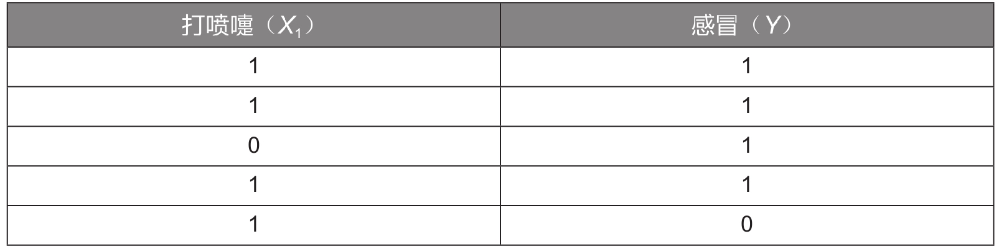

## 朴素贝叶斯的算法原理

贝叶斯分类是机器学习中应用极为广泛的分类算法之一，其产生自英国数学家贝叶斯对于逆概问题的思考。朴素贝叶斯是贝叶斯模型当中最简单的一种，其算法核心为如下所示的贝叶斯公式：

$$P(A|B) = \frac{P(B|A)P(A)}{P(B)}$$

其中P（A）为事件A发生的概率，P（B）为事件B发生的概率，P（A|B）表示在事件B发生的条件下事件A发生的概率，同理P（B|A）则表示在事件A发生的条件下事件B发生的概率。

举一个简单的例子：已知冬季一个人感冒（事件A）的概率P（A）为40%，一个人打喷嚏（事件B）的概率P（B）为80%，一个人感冒时打喷嚏的概率P（B|A）为100%，那么如果一个人开始打喷嚏，他感冒的概率P（A|B）为多少？

求解过程如下:

$$P(A|B) = \frac{P(B|A)P(A)}{P(B)}=\frac{100\%\times40\%}{80\%}=50\%$$

## 一维特征变量下的贝叶斯模型

下面通过一个详细的例子来讲解贝叶斯模型的实战应用：如何判断一个人是否感冒。假设已经有5组样本数据，见下表：

为方便演示，这里只选取了一个特征变量“打喷嚏 $（X_1）$ ”，其值为1表示打喷嚏，为0表示不打喷嚏；目标变量是“感冒（Y）”，其值为1表示感冒，为0表示未感冒。

现在要根据上述数据，利用贝叶斯公式预测一个人是否感冒。例如，一个人打喷嚏了 $（X_1＝1）$ ，那么他是否感冒了呢？这个问题实际上是要预测他感冒的概率 $P（Y|X_1）$。

将特征变量和目标变量代入贝叶斯公式，可获得如下所示的计算公式：

$$P(Y|X_1) = \frac{P(X_1|Y)P(Y)}{P(X_1)}$$

根据上述数据，可以计算在打喷嚏 $（X_1＝1）$ 的条件下，感冒（Y＝1）的概率，计算过程如下：

$$P(Y=1|X_1=1)=\frac{P(X_1|Y=1)P(Y=1)}{P(X_1)}=\frac{\frac{3}{4}\times\frac{4}{5}}{\frac{4}{5}}=\frac{3}{4}$$

其中 $P（X_1＝1|Y＝1）$ 为在感冒的条件下打喷嚏的概率，这里感冒的4个样本中有3个样本打喷嚏，所以该概率为3/4；P（Y＝1）为所有样本中感冒的概率，这里5个样本中有4个样本感冒，所以该概率为4/5； $P（X_1＝1）$ 为所有样本中打喷嚏的概率，这里5个样本中有4个样本打喷嚏，所以该概率为4/5。

同理，在打喷嚏 $（X_1＝1）$ 的条件下，未感冒（Y＝0）的概率的计算过程如下：

$$P(Y=0|X_1=1)=\frac{P(X_1|Y=0)P(Y=0)}{P(X_1)}=\frac{1\times\frac{1}{5}}{\frac{4}{5}}=\frac{1}{4}$$

其中P $（X_1＝1|Y＝0）$ 为在未感冒的条件下打喷嚏的概率，为1； $P（Y＝0）$ 为所有样本中未感冒的概率，为1/5； $P（X_1＝1）$ 为所有样本中打喷嚏的概率，为4/5。

因为3/4大于1/4，所以在打喷嚏的条件下感冒的概率要高于未感冒的概率。

## 二维特征变量下的贝叶斯模型

现在加入另一个特征变量——头痛 $（X_2）$ ，其值为1表示头痛，为0表示不头痛；目标变量仍为感冒（Y）。

样本数据见下表：

根据上述数据，我们仍利用贝叶斯公式来预测一个人是否感冒。例如，一个人打喷嚏且头痛 $（X_1＝1,X_2＝1）$ ，那么他是否感冒了呢？这个问题实际上是要预测他感冒的概率 $P（Y|X_1,X_2）$ 。

将特征变量和目标变量代入贝叶斯公式，可获得如下所示的计算公式：

$$P(Y|X_1,X_2)=\frac{P(X_1, X_2|Y)P(Y)}{P(X_1,X_2)}$$

现在要计算并比较 $P(Y＝1|X_1,X_2)$ 与 $P(Y＝0|X_1，X_2)$ 的大小，由上述公式可知，两者的分母 $P(X_1,X_2)$ 是相同的，所以直接计算并比较两者的分子 $P(X_1,X_2|Y)P(Y)$ 的大小即可。

在计算之前，需要先引入朴素贝叶斯模型的独立性假设：朴素贝叶斯模型中的各个特征之间相互独立，即 $P(X_1,X_2|Y)＝P(X_1|Y)P(X_2|Y)$ 。因此，分子的计算公式可以转换为如下形式：

$$P(X_1,X_2|Y)P(Y)=P(X_1|Y)P(X_2|Y)P(Y)$$

在独立性假设的前提下，计算打喷嚏且头痛 $(X_1＝1,X_2＝1)$ 的条件下感冒 $(Y＝1)$ 的概率 $P(Y＝1|X_1＝1,X_2＝1)$ ，就转化为计算 $P(X_1＝1|Y＝1)P(X_2＝1|Y＝1)P(Y＝1)$ 的值，计算过程如下：

$$P(X_1=1|Y)P(X_2=1|Y=1)P(Y=1)=\frac{3}{4}\times\frac{3}{4}\times\frac{4}{5}$$

同理，计算打喷嚏且头痛 $(X_1＝1,X_2＝1)$ 的条件下未感冒 $(Y＝0)$ 的概率 $P(Y＝0|X_1＝1,X_2＝1)$  ，即转化为计算 $P(X_1＝1|Y＝0)P(X_2＝1|Y＝0)P(Y＝0)$ 的值，计算过程如下：

$$P(X_1=1|Y=0)P(X_2=1|Y=0)P(Y=0)=1\times1\times\frac{1}{5}=\frac{1}{5}$$

因为9/20大于1/5，所以在打喷嚏且头痛的条件下感冒的概率要高于未感冒的概率。

## N维特征变量下的贝叶斯模型

我们可以在2个特征变量的基础上将贝叶斯公式推广至n个特征变量 $X_1,X_2,…,X_n$，公式如下：

$$P(X_1,X_2,...,X_n|Y)P(Y) = P(X_1|Y)P(X_2|Y)P(X_3|Y)...P(X_n|Y)P(Y)$$

其中 $P(X_1|Y)、P(X_2|Y)、P(Y)$等数据都是已知的，由此可以计算在n个特征变量取不同的值的条件下，目标变量取某个值的概率，并且选择概率更高者对样本进行分类。
