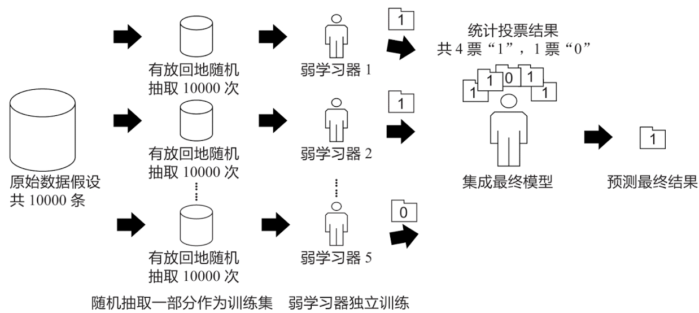
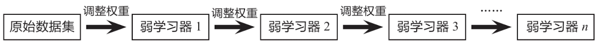
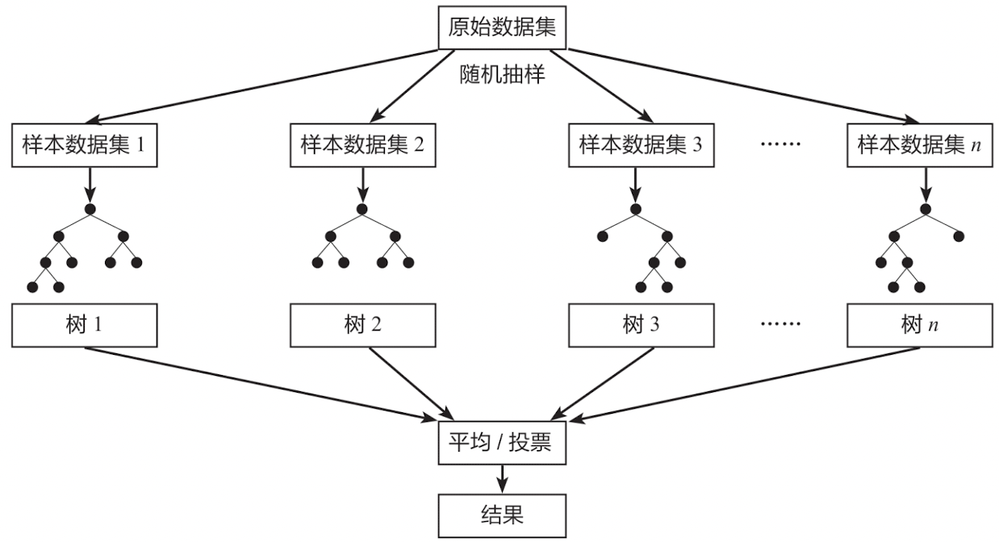

集成学习模型，是机器学习中非常重要的组成部分。其核心思想是，将多个模型组合在一起，从而产生更强大的模型。**随机森林模型**，是一个非常典型的集成学习模型。

## 集成模型简介

集成学习模型使用一系列弱学习器(也称为基础模型或基模型)进行学习，并将各个弱学习器的结果进行整合，从而获得比单个学习器更好的学习效果。

集成学习模型的常见算法有Bagging算法和Boosting算法。Bagging算法的典型机器学习模型为随机森林模型，而Boosting算法的典型机器学习模型为AdaBoost、GBDT、XGBoost和LightGBM模型。

### Bagging算法
Bagging算法的原理类似投票，每个弱学习器都有一票，最终根据所有弱学习器的投票，按照**少数服从多数**的原则产生最终结果。如下图所示：

假设原始数据共有10000条，从中随机有放回地抽取10000次数据构成一个新的训练集(因为是随机有放回抽样，所以可能出现某一条数据多次被抽中，也有可能某一条数据一次也没有被抽中)，每次使用一个训练集训练一个弱学习器。这样有放回地随机抽取n次后，训练结束时就能获得由不同的训练集训练出的n个弱学习器，根据这n个弱学习器的预测结果，按照“少数服从多数”的原则，获得一个更加准确、合理的最终预测结果。

具体来说，在分类问题中是用n个弱学习器投票的方式获取最终结果，在回归问题中则是取n个弱学习器的平均值作为最终结果。

### Boosting算法

Boosting算法的本质是**将弱学习器提升为强学习器**，它和Bagging算法的区别在于：Bagging算法对待所有的弱学习器一视同仁，而Boosting算法则会对弱学习器“区别对待”。通俗来讲就是注重“培养精英”和“重视错误”。

“培养精英”就是每一轮训练后对预测结果较准确的弱学习器给予较大的权重，对表现不好的弱学习器则降低其权重。这样在最终预测时，“优秀模型”的权重是大的，相当于它可以投出多票，而“一般模型”只能投出一票或不能投票。

“重视错误”就是在每一轮训练后改变训练集的权值或概率分布，通过提高在前一轮被弱学习器预测错误的样例的权值，降低前一轮被弱学习器预测正确的样例的权值，来提高弱学习器对预测错误的数据的重视程度，从而提升模型的整体预测效果。上述原理如下图所示：

## 随机森林模型的基本原理

随机森林(Random Forest)是一种经典的Bagging模型，其弱学习器为[决策树模型][1]。如下图所示，随机森林模型会在原始数据集中随机抽样，构成n个不同的样本数据集，然后根据这些数据集搭建n个不同的决策树模型，最后根据这些决策树模型的平均值(针对回归模型)或者投票情况(针对分类模型)来获取最终结果。

为了保证模型的泛化能力，随机森林模型在建立每棵树时，往往会遵循**数据随机**和**特征随机**两个基本原则。

### 数据随机

从所有数据当中有放回地随机抽取数据作为其中一个决策树模型的训练数据。例如，有1000个原始数据，有放回地抽取1000次，构成一组新的数据，用于训练某一个决策树模型。

### 特征随机

如果每个样本的特征维度是M，指定一个常数k<M，随机地从M个特征中选取k个特征。在Python中构造随机森林模型时，默认选取特征的个数是 $k=\sqrt[]{M}$

与单独的决策树模型相比，随机森林模型由于集成了多个决策树，其预测结果会更准确，且不容易造成过拟合现象，泛化能力也更强。

  [1]: https://github.com/likuli/data-analysis-learning/blob/main/docs/analysis_ai/decision_tree.md