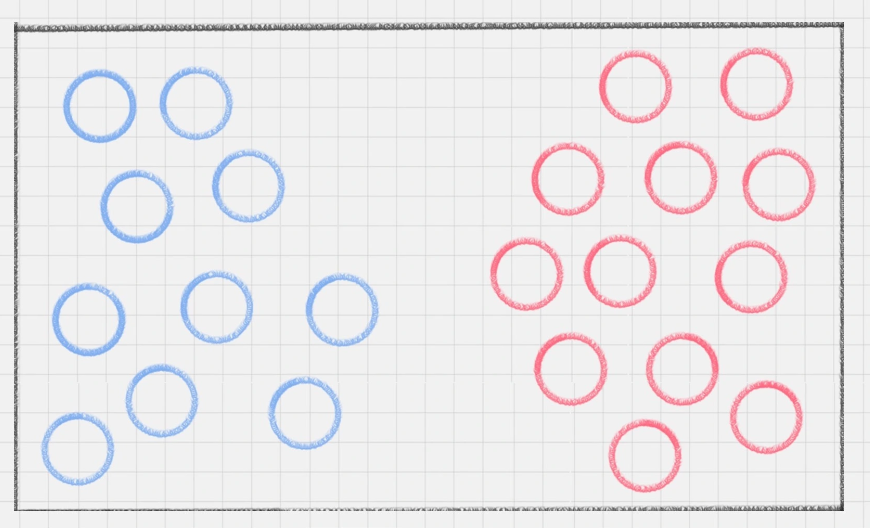
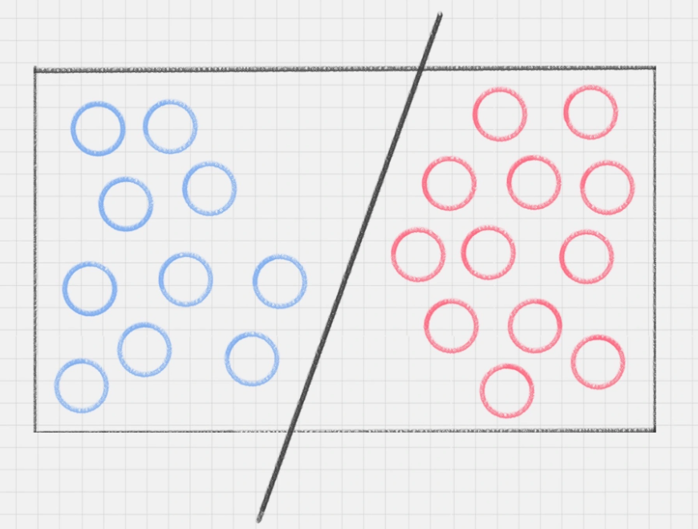
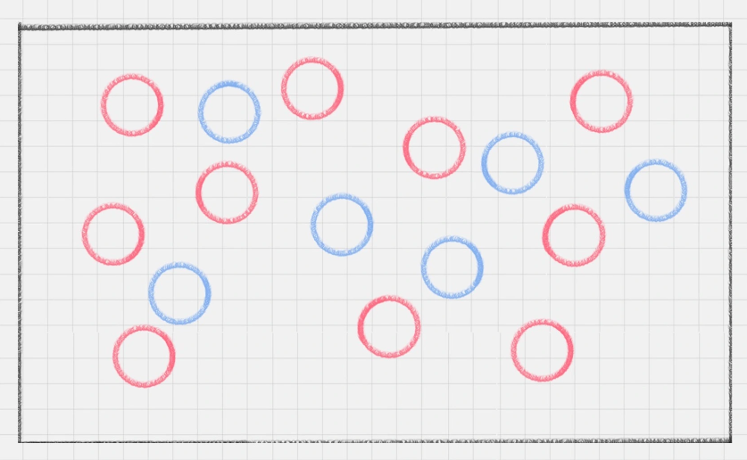
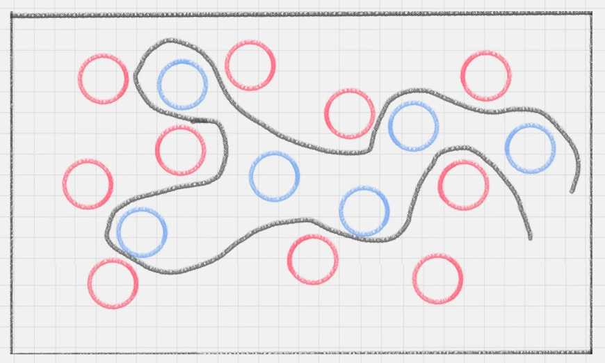
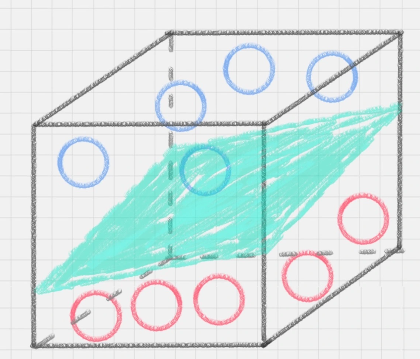
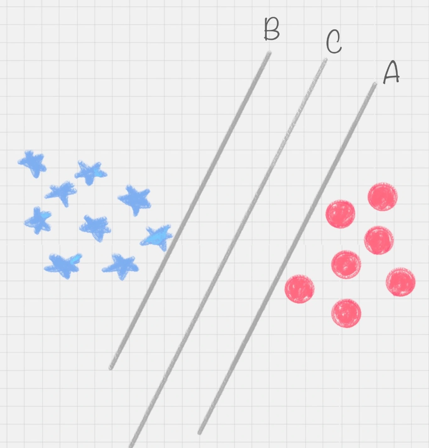
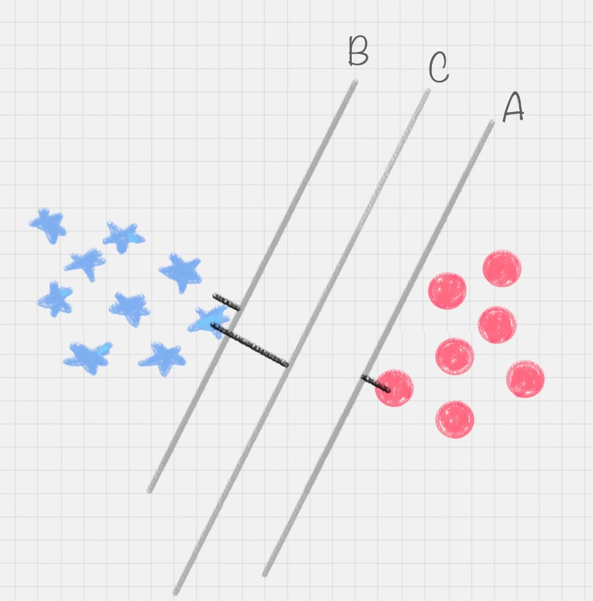
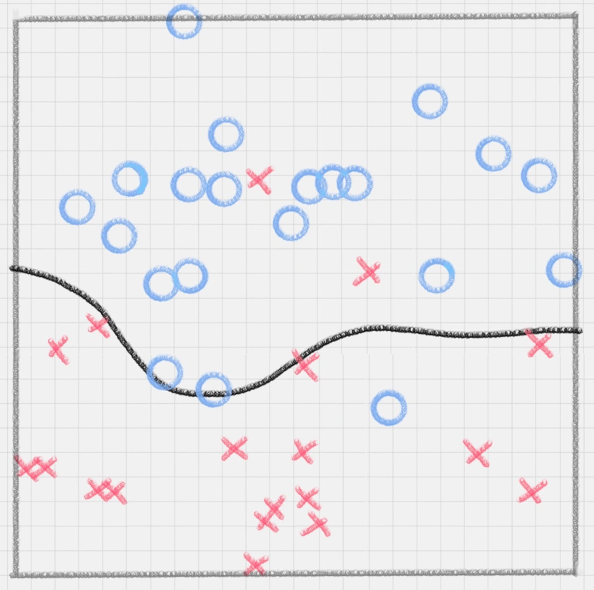
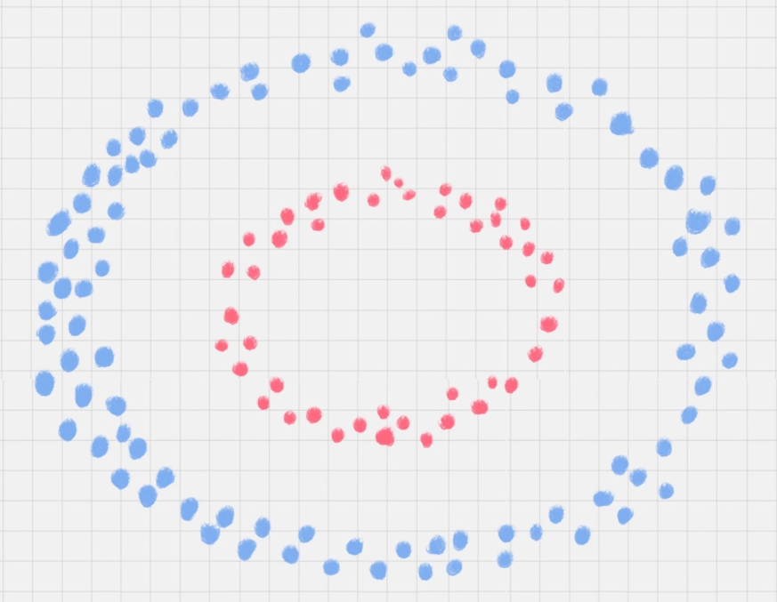

## 初识SVM

SVM的英文全称叫Support Vector Machine，中文名为支持向量机。在机器学习领域，SVM是一种常见的分类方法，属于有监督的学习模型。

为了理解SVM模型，我们先来看一个小练习。

桌子上放了红、蓝两种颜色的球，我们如何用一条线将两种球分开？

这种情况很好解决，我们在两种颜色的球之间画条直线就好，如下图所示：

接下来难度升级，桌子上依然放两种颜色的球，但是摆放不再规律，如下图所示：

这时如何用一条线将两种球分开？首先想到的是用曲线，如下图所示：

直线变成了曲线，且曲线的复杂度很高。如果在同一个平面来看，红蓝两种颜色的球很难分开，那有没有一种方式，可以让它们自然地分开呢？

一个巧妙的办法就是，猛拍一下桌子，让小球腾空而起，在腾起的一刹那，恰好出现一个水平切面，把红蓝两种颜色的球分开，如下图所示：

这时，二维平面变成了三维空间。原来的曲线变成了一个平面。这个平面，叫做**超平面**。

## SVM的工作原理

SVM的计算过程就是寻找超平面的过程。

我们再来看上述小练习，其实我们可以划出多个直线，如下图所示：

图中的直线B更靠近蓝色球，在真实场景下，球如果再多一些的话，蓝色球可能就被划分到了直线B的右侧，被认为是红色球。同样直线A更靠近红色球，同理，红色球再多的话，也可能被误认为是蓝色球。所以相比于直线A和直线B，直线C的划分更优。因为它的健壮性更强。

那怎样才能找到最优解呢？我们需要引入一个新的概念**分类间隔**。

实际上，我们的分类环境不是在二维平面中的，而是在多维空间中，这样直线 C 就变成了决策面 C。

在保证决策面不变，且分类不产生错误的情况下，我们可以移动决策面C，直到产生两个极限的位置：如图中的决策面 A 和决策面 B。极限的位置是指，如果越过了这个位置，就会产生分类错误。这样的话，两个极限位置 A 和 B 之间的分界线 C 就是最优决策面。极限位置到最优决策面 C 之间的距离，就是“分类间隔”，英文叫做 margin。

如果我们转动这个最优决策面，会发现可能存在多个最优决策面，它们都能把数据集正确分开，这些最优决策面的分类间隔可能是不同的，而那个拥有“最大间隔”（max margin）的决策面就是 SVM 要找的最优解。

在上面这个例子中，如果我们把红蓝两种颜色的球放到一个三维空间里，会发现决策面就变成了一个平面。可以用线性函数来表示，如果在一维空间里就表示一个点，在二维空间里表示一条直线，在三维空间中代表一个平面，当然空间维数还可以更多，这样我们给这个线性函数起个名称叫做“超平面”。超平面的数学表达可以写成：

$$g(x) = w^Tx+b \quad (w,x \in R^n)$$

在公式里，w、x 是n维空间里的向量，其中x是函数变量；w是法向量。法向量这里指的是垂直于平面的直线所表示的向量，它决定了超平面的方向。

SVM 就是帮我们找到一个超平面，这个超平面能将不同的样本划分开，同时使得样本集中的点到这个分类超平面的最小距离（即分类间隔）最大化。

在这个过程中，支持向量就是离分类超平面最近的样本点，如果确定了支持向量也就确定了这个超平面。所以支持向量决定了分类间隔到底是多少，而在最大间隔以外的样本点，其实对分类都没有意义。所以说， SVM就是**求解最大分类间隔的过程**，我们还需要对分类间隔的大小进行定义。

首先，我们定义某类样本集到超平面的距离是这个样本集合内的样本到超平面的最短距离。用 $d_i$ 代表点 $x_i$ 到超平面 $wx_i+b=0$ 的欧氏距离。因此我们要求 $d_i$ 的最小值，用它来代表这个样本到超平面的最短距离。 $d_i$ 可以用公式计算得出：

$$ d_i = \frac{|wx_i+b|}{||w||}$$

其中||w||为超平面的范数， $d_i$ 的公式可以用解析几何知识进行推导，这里不再解释。

我们的目标就是找出所有分类间隔中最大的那个值对应的超平面。在数学上，这是一个凸优化问题（凸优化就是关于求凸集中的凸函数最小化的问题，这里不具体展开）。通过凸优化问题，最后可以求出最优的 w 和 b，也就是我们想要找的最优超平面。中间求解的过程会用到拉格朗日乘子，和 KKT（Karush-Kuhn-Tucker）条件。数学公式比较多，这里不进行展开。

## 硬间隔、软间隔和非线性SVM

假如数据是完全的线性可分的，那么学习到的模型可以称为**硬间隔支持向量机**。换个说法，硬间隔指的就是完全分类准确，不能存在分类错误的情况。软间隔，就是允许一定量的样本分类错误。

因为实际工作中的数据没有那么“干净”，或多或少都会存在一些噪点。所以线性可分是个理想情况。这时，我们需要使用到软间隔 SVM（近似线性可分），比如下面这种情况：

另外还存在一种情况，就是非线性支持向量机。

比如下面的样本集就是个非线性的数据。图中的两类数据，分别分布为两个圆圈的形状。那么这种情况下，不论是多高级的分类器，只要映射函数是线性的，就没法处理SVM也处理不了。这时，我们需要引入一个新的概念：核函数。它可以将样本从原始空间映射到一个更高维的特质空间中，使得样本在新的空间中线性可分。这样我们就可以使用原来的推导来进行计算，只是所有的推导是在新的空间，而不是在原来的空间中进行。

所以在非线性 SVM 中，核函数的选择就是影响SVM最大的变量。最常用的核函数有线性核、多项式核、高斯核、拉普拉斯核、sigmoid核，或者是这些核函数的组合。这些函数的区别在于映射方式的不同。通过这些核函数，我们就可以把样本空间投射到新的高维空间中。

当然软间隔和核函数的提出，都是为了方便我们对上面超平面公式中的w\*和b\*进行求解，从而得到最大分类间隔的超平面。

## 用SVM如何解决多分类问题

SVM本身是一个二值分类器，最初是为二分类问题设计的，也就是回答Yes或者是No。而实际上我们要解决的问题，可能是多分类的情况，比如对文本进行分类，或者对图像进行识别。

针对这种情况，我们可以将多个二分类器组合起来形成一个多分类器，常见的方法有“一对多法”和“一对一法”两种。

### 1. 一对多法

假设我们要把物体分成A、B、C、D四种分类，那么我们可以先把其中的一类作为分类1，其他类统一归为分类2。这样我们可以构造4种SVM，分别为以下的情况：

（1）样本A作为正集，B，C，D 作为负集；
（2）样本B作为正集，A，C，D 作为负集；
（3）样本C作为正集，A，B，D 作为负集；
（4）样本D作为正集，A，B，C 作为负集。

这种方法，针对K个分类，需要训练K个分类器，分类速度较快，但训练速度较慢，因为每个分类器都需要对全部样本进行训练，而且负样本数量远大于正样本数量，会造成样本不对称的情况，而且当增加新的分类，比如第K+1类时，需要重新对分类器进行构造。

### 2. 一对一法

一对一法的初衷是想在训练的时候更加灵活。我们可以在任意两类样本之间构造一个SVM，这样针对K类的样本，就会有C(k,2)类分类器。

比如我们想要划分A、B、C三个类，可以构造 3 个分类器：

（1）分类器 1：A、B；
（2）分类器 2：A、C；
（3）分类器 3：B、C。

当对一个未知样本进行分类时，每一个分类器都会有一个分类结果，即为1票，最终得票最多的类别就是整个未知样本的类别。

这样做的好处是，如果新增一类，不需要重新训练所有的SVM，只需要训练和新增这一类样本的分类器。而且这种方式在训练单个SVM模型的时候，训练速度快。

但这种方法的不足在于，分类器的个数与K的平方成正比，所以当K较大时，训练和测试的时间会比较慢。

## 总结

SVM分类器在解决二分类问题时性能卓越。针对多分类的情况，可以用一对多或一对一的方法，把多个二分类器组合成一个多分类器。

另外，对于SVM分类器，我们需要掌握以下三个内容：

（1）完全线性可分情况下的线性分类器，也就是线性可分的情况，是最原始的SVM，它最核心的思想就是找到最大的分类间隔；

（2）大部分线性可分情况下的线性分类器，引入了软间隔的概念。软间隔，就是允许一定量的样本分类错误；

（3）线性不可分情况下的非线性分类器，引入了核函数。它让原有的样本空间通过核函数投射到了一个高维的空间中，从而变得线性可分。

