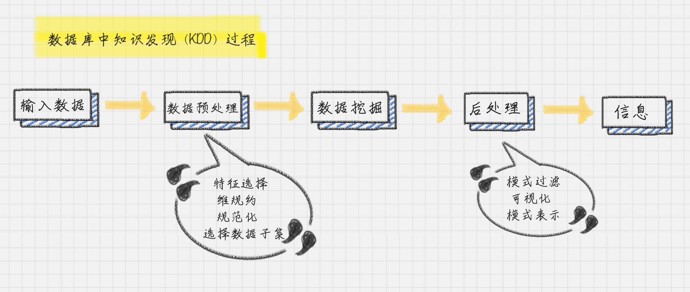

美国明尼苏达州一家 Target 百货被客户投诉，这名客户指控 Target 将婴儿产品优惠券寄给他的女儿，而他女儿还是一名高中生。但没多久这名客户就来电道歉，因为女儿经他逼问后坦承自己真的怀孕了。

Target 百货寄送婴儿产品优惠券绝非偶然之举，他们发现妇女在怀孕的情况下，购买的物品会发生变化，比如护手霜会从有香味的改成无味的，此外还会购买大量维生素等保健品。通过类似的关联分析，Target 构建了一个“怀孕预测指数”，通过这个指数预测到了顾客已经怀孕的情况，并把优惠券寄送给她。

那么顾客怀孕与商品之间的关联关系是如何被发现的呢？

实际上他们都是用的 Apriori 算法，该算法是由美国学者 Agrawal 在 1994 年提出的。他通过分析购物篮中的商品集合，找出商品之间的关联关系。利用这种隐性关联关系，商家就可以强化这类购买行为，从而提升销售额。

这就是数据分析的力量，人们总是从数据分析中得到有价值的信息，啤酒和尿布的故事也是个经典的案例。如今在超市中，我们还能看到不少组合的套装打包在一起卖，比如宝洁的产品：飘柔洗发水 + 玉兰油沐浴露、海飞丝洗发水 + 舒肤佳沐浴露等等。

商品的捆绑销售是个很有用的营销方式，背后都是数据分析在发挥作用。

## 商业智能 BI、数据仓库 DW、数据挖掘 DM 三者之间的关系
开头中的百货商店利用数据预测用户购物行为属于商业智能，他们积累的顾客的消费行为习惯会存储在数据仓库中，通过对个体进行消费行为分析总结出来的规律属于数据挖掘。

所以我们能在这个场景里看到三个重要的概念：商业智能、数据仓库和数据挖掘。

**商业智能**，英文是 Business Intelligence，缩写是 BI。相比于数据仓库、数据挖掘，它是一个更大的概念。商业智能可以说是基于数据仓库，经过了数据挖掘后，得到了商业价值的过程。所以说数据仓库是个金矿，数据挖掘是炼金术，而商业报告则是黄金。

**数据仓库**，英文是 Data Warehouse，缩写是 DW。它可以说是 BI 这个房子的地基，搭建好 DW 这个地基之后，才能进行分析使用，最后产生价值。

数据仓库可以说是数据库的升级概念。从逻辑上理解，数据库和数据仓库没有什么区别，都是通过数据库技术来存储数据的。不过从数量上来讲，数据仓库的量更庞大，适用于数据挖掘和数据分析。数据库可以理解是一项技术。

数据仓库将原有的多个数据来源中的数据进行汇总、整理而得。数据进入数据仓库前，必须消除数据中的不一致性，方便后续进行数据分析和挖掘。

**数据挖掘**，英文是 Data Mining，缩写是 DM。在商业智能 BI 中经常会使用到数据挖掘技术。数据挖掘的核心包括分类、聚类、预测、关联分析等任务，通过这些炼金术，我们可以从数据仓库中得到宝藏，比如商业报告。

很多时候，企业老板总是以结果为导向，他们认为商业报告才是他们想要的，但是这也是需要经过地基 DW、搬运工 ETL、科学家 DM 等共同的努力才得到的。

## 元数据 VS 数据元

我们前面提到了数据仓库，在数据仓库中，还有一类重要的数据是元数据，那么它和数据元有什么区别呢？

**元数据（MetaData）**：描述其它数据的数据，也称为“中介数据”。

**数据元（Data Element）**：就是最小数据单元。

在生活中，只要有一类事物，就可以定义一套元数据。举个例子，比如一本图书的信息包括了书名、作者、出版社、ISBN、出版时间、页数和定价等多个属性的信息，我们就可以把这些属性定义成一套图书的元数据。在图书这个元数据中，书名、作者、出版社就是数据元。你可以理解是最小的数据单元。元数据最大的好处是使信息的描述和分类实现了结构化，让机器处理起来很方便。

元数据可以很方便地应用于数据仓库。比如数据仓库中有数据和数据之间的各种复杂关系，为了描述这些关系，元数据可以对数据仓库的数据进行定义，刻画数据的抽取和转换规则，存储与数据仓库主题有关的各种信息。而且整个数据仓库的运行都是基于元数据的，比如抽取调度数据、获取历史数据等。

通过元数据，可以很方便地帮助我们管理数据仓库。

## 数据挖掘的流程

聊完了数据仓库，我们再来谈谈数据挖掘。数据挖掘不是凭空产生的，它与数据库技术的发展分不开。数据挖掘的一个英文解释叫 Knowledge Discovery in Database，简称 KDD，也就是数据库中的知识发现。

在数据挖掘中，有几个非常重要的任务，就是分类、聚类、预测和关联分析。

我来解释下这些概念。

### 1. 分类

就是通过训练集得到一个分类模型，然后用这个模型可以对其他数据进行分类。

这里需要说明下训练集和测试集的概念。一般来说数据可以划分为训练集和测试集。训练集是用来给机器做训练的，通常是人们整理好训练数据，以及这些数据对应的分类标识。通过训练，机器就产生了自我分类的模型，然后机器就可以拿着这个分类模型，对测试集中的数据进行分类预测。同样如果测试集中，人们已经给出了测试结果，我们就可以用测试结果来做验证，从而了解分类器在测试环境下的表现。

### 2. 聚类

人以群分，物以类聚。

聚类就是将数据自动聚类成几个类别，聚到一起的相似度大，不在一起的差异性大。我们往往利用聚类来做数据划分。

### 3. 预测

顾名思义，就是通过当前和历史数据来预测未来趋势，它可以更好地帮助我们识别机遇和风险。

### 4. 关联分析

就是发现数据中的关联规则，它被广泛应用在购物篮分析，或事务数据分析中。比如我们开头提到的那个案例。

数据挖掘要怎么完成这些任务呢？它需要将数据库中的数据经过一系列的加工计算，最终得出有用的信息。

这个过程可以用以下步骤来描述。

首先，输入我们收集到的数据，然后对数据进行预处理。预处理通常是将数据转化成我们想要的格式，然后我们再对数据进行挖掘，最后通过后处理得到我们想要的信息。

那你可能想问，为什么不直接进行数据挖掘，还要进行数据预处理呢？

因为在这个过程中，输入的数据通常是从不同渠道采集而来的，所以数据的格式以及质量是参差不齐的，所以我们需要对数据进行预处理。

数据预处理中，我们会对数据进行几个处理步骤：数据清洗，数据集成，以及数据变换。

1. 数据清洗

主要是为了去除重复数据，去噪声（即干扰数据）以及填充缺失值。

2. 数据集成

是将多个数据源中的数据存放在一个统一的数据存储中。

3. 数据变换

就是将数据转换成适合数据挖掘的形式。比如，通过归一化将属性数据按照比例缩放，这样就可以将数值落入一个特定的区间内，比如 0~1 之间。

我会在后面的几节课给你讲解如何对数据进行预处理。

数据后处理是将模型预测的结果进一步处理后，再导出。比如在二分类问题中，一般能得到的是 0~1 之间的概率值，此时把数据以 0.5 为界限进行四舍五入就可以实现后处理。

## 戏说数据概念

说了这么多概念，可能你还是觉得很抽象，我来打个比喻。

比如你认识了两个漂亮的女孩。

商业智能会告诉你要追哪个？成功概率有多大？

数据仓库会说，我这里存储了这两个女孩的相关信息，你要吗？

其中每个女孩的数据都有单独的文件夹，里面有她们各自的姓名、生日、喜好和联系方式等，这些具体的信息就是数据元，加起来叫作元数据。

数据挖掘会帮助你确定追哪个女孩，并且整理好数据仓库，这里就可以使用到各种算法，帮你做决策了。

你可能会用到分类算法。御姐、萝莉、女王，她到底属于哪个分类？

如果认识的女孩太多了，多到你已经数不过来了，比如说 5 万人！你就可以使用聚类算法了，它帮你把这些女孩分成多个群组，比如 5 个组。然后再对每个群组的特性进行了解，进行决策。这样就把 5 万人的决策，转化成了 5 个组的决策。成功实现降维，大大提升了效率。如果你想知道这个女孩的闺蜜是谁，那么关联分析算法可以告诉你。

如果你的数据来源比较多，比如有很多朋友给你介绍女朋友，很多人都推荐了同一个，你就需要去重，这叫数据清洗；为了方便记忆，你把不同朋友推荐的女孩信息合成一个，这叫数据集成；有些数据渠道统计的体重的单位是公斤，有些是斤，你就需要将它们转换成同一个单位，这叫数据变换。

最后你可以进行数据可视化了，它会直观地把你想要的结果呈现出来。

上帝不会告诉我们规律，而是展示给我们数据。

还记得高中物理课上我们计算自由落体运动加速度的实验吗？

我们将重物连上纸带，通过电火花打点计时器，在纸带上会出现多个打点。然后我们通过纸带上打点的个数，以及点之间的间距，来计算自由落体运动的加速度。通过多组实验，取平均值的方式将误差降到最小。

在我们的高中时代，许多定律都是通过实验得出的。参加工作以后，很多数据是业务数据，比如电商的客户购物数据等，这些数据依然有着某些规律。这就需要我们通过数据挖掘的力量来帮我们揭示规律，通过利用这些规律，可以帮我们创造更大的价值。