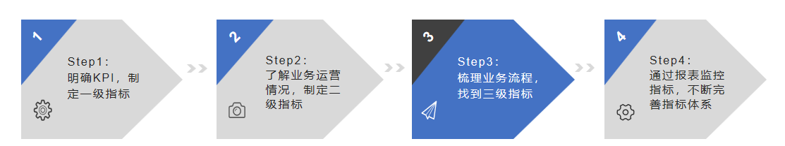
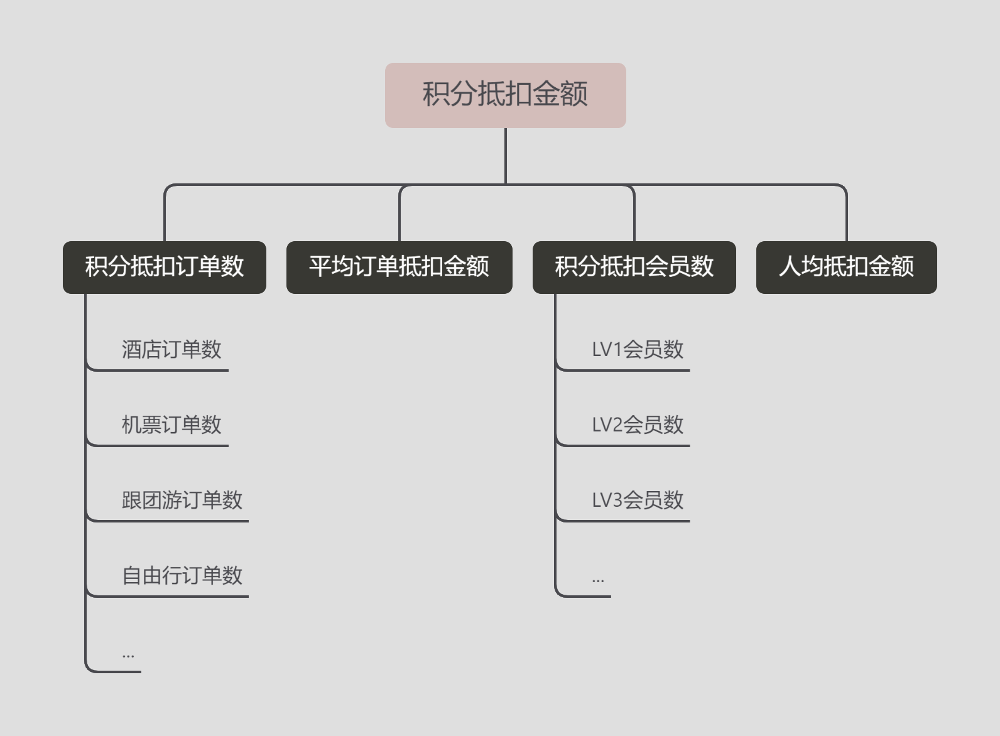

## 什么是指标体系？

 为了解释同一个业务问题，将多个指标有逻辑、有系统的组织起来，就叫指标体系。

日常聊天，我们常常会说“大概、可能、应该、我感觉...”，例如，领导问我，“小李呀，你们产品的性能怎么样？”，我说，“应该还行吧，挺快的”。 这种回答，日常闲聊没问题。但在正式汇报工作或定位问题原因时，必须要用准确数据来描述。

上边的对话可以改成，“竞品的平均响应时间是800ms，我们产品的平均响应时间是600ms，比竞品快25%。” 这就是通过数据回答问题的一个案例。

实际工作中，只用一个指标很难解释清楚业务问题，需要多个指标从不同维度解释同一问题，这就是指标体系。

## 建立指标体系的意义是什么？

在看体检报告时，常常包括血压、血脂、视力、B超、X光等多个维度，单纯知道其中一项或几项，不能了解我们的健康状况的。

例如，我的体检报告里的指标几乎全部正常，但有一项颈椎生理曲度变直。只有把所有指标综合起来考虑，才能了解我的健康状况。

同样，对于一家公司的业务状况是否良好，也需要通过完善的指标体系对业务进行监控。当业务出现异常时，能迅速发现问题，并找到正确的解决方案。 所以，指标体系的作用在于：

（1）监控业务运行状态；

（2）寻找现存业务问题；

（3）明确未来工作方向；

（4）减少大量重复工作（一次建设，长期使用）。

## 如何建立完善的指标体系？

建立指标体系的步骤如下：

#### step1：明确当前KPI，确定一级指标

一级指标是公司运营情况的最核心指标。

例如，旅游公司在会员积分开销较大，业务部门关心成本，定的KPI是合理利用积分抵扣金额，以节省成本，所以该部门的一级指标就是积分抵扣金额。

一级指标并非只能是一个指标，有可能是多个指标。

例如，网贷公司的主要工作是，开发符合市场需求的贷款产品，在提升放款量的同时，也需要关注逾期率，所以该公司的KPI有两个，放款金额和坏账率。

#### step2：了解运营情况，确定二级指标

明确一级指标后，将一级指标拆解成二级指标。

以积分抵扣为例，从订单维度拆解：

积分抵扣金额 = 积分抵扣订单数 x 平均订单抵扣金额

从会员维度拆解：

积分抵扣金额 = 积分抵扣会员数 x 人均抵扣金额

#### step3：梳理业务流程，确定三级指标

一级指标通常是业务流程的最终结果。

例如，积分抵扣金额是业务流程（会员->会员购买旅游产品->使用积分抵扣->支付金额）的结果。

只有结果，无法监督、改进流程，无法找到业务的问题所在。

因此，需要更粒度的三级指标。

假设，不同的会员等级、不同的产品可以使用的积分抵扣的金额不同，那么，按业务流程拆解三级指标就是，会员节点拆解为LV1级会员、LV2级会员、LV3级会员...，购买产品业务节点可以拆解为酒店订单、机票订单、自由行订单等。

拆解完成的指标体系：

#### step4：通过报表监控，更新完善指标

根据上述一、二、三级指标，制作报表，验证报表质量，根据业务变动，动态调整完善指标。

> 补充说明：在学习这部分时，还参考了GrowingIO丛书《指标体系与数据采集》，本来想写写OSM和UJM模型，但自己理解并不到位，甚至一度没搞明白两者的区别，所以没写。想学数据分析的可自行补充学习。

## 建立指标体系的常见问题有哪些？

（1）一级指标错误，抓不住重点

例如，评估程序员的工作情况，定下的评估标准是：产生的BUG数量越少，则代表工作完成的越好。

结果，A程序员一年只写了100行代码，是所有程序员中产出量最少的，但是因为符合上述评估标准，其绩效比其他程序员更好。

（2）指标不成体系，逻辑有漏洞

按我们的常规思维，更容易关注结果数据，忽略过程数据。导致缺少体系化、逻辑严谨的指标结构，在业务出现问题时，难以快速定位原因，没办法解决问题。

（3）数据不全，反复采集数据

数据准备工作，是一项占用大量时间，还不容易看到成果的阶段，如果前期思考不全，导致反复处于数据准备阶段，浪费人力，进展缓慢。

（4）数据治理不够充分

数据治理不充分，数据表多、数乱、业务维度不一致，导致数据分析效率底下。

（5）指标没有业务意义

指标很多，但没有业务意义，导致最终报表就是一堆没用的数字。