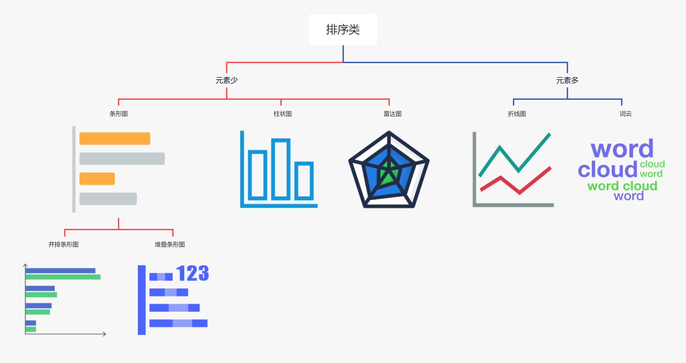
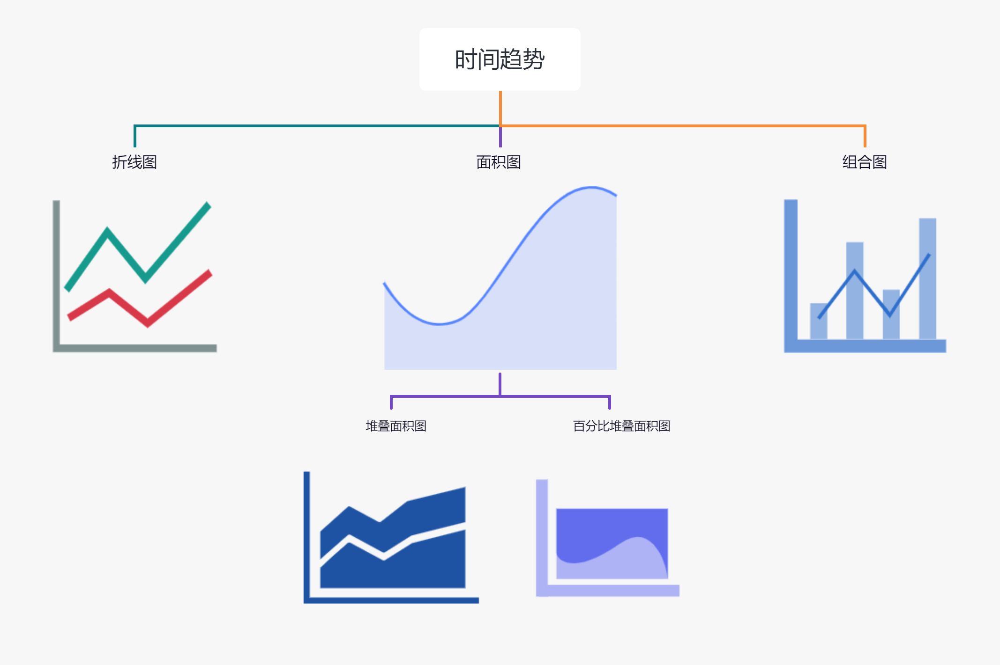
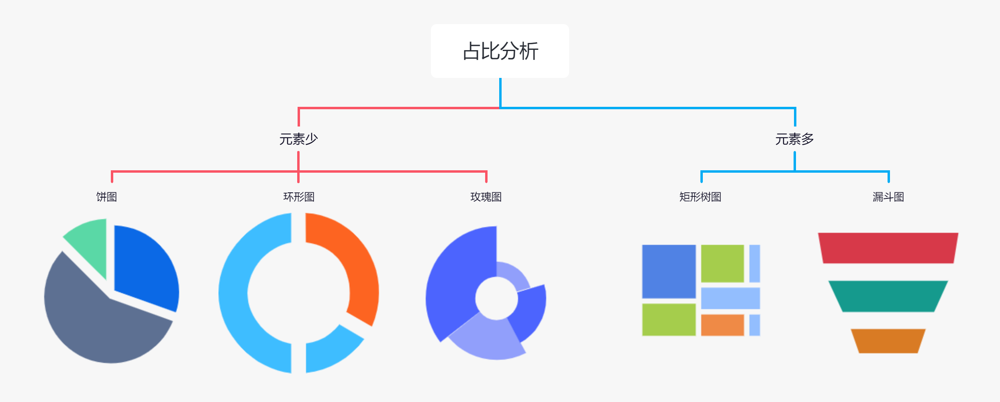
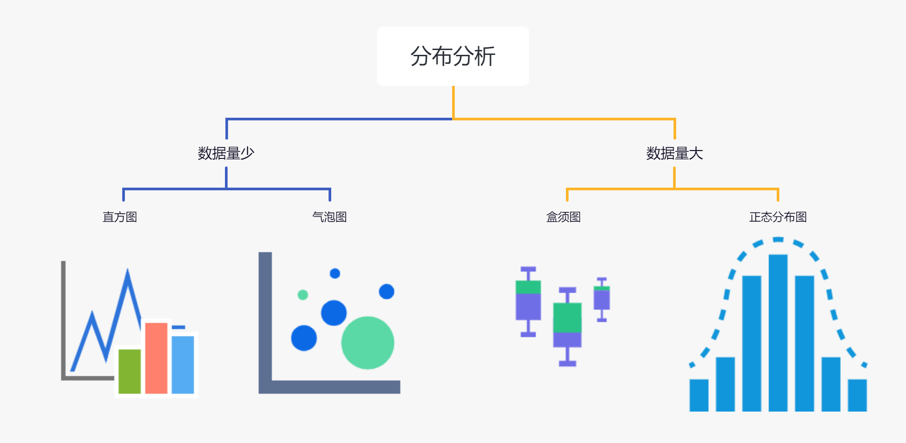
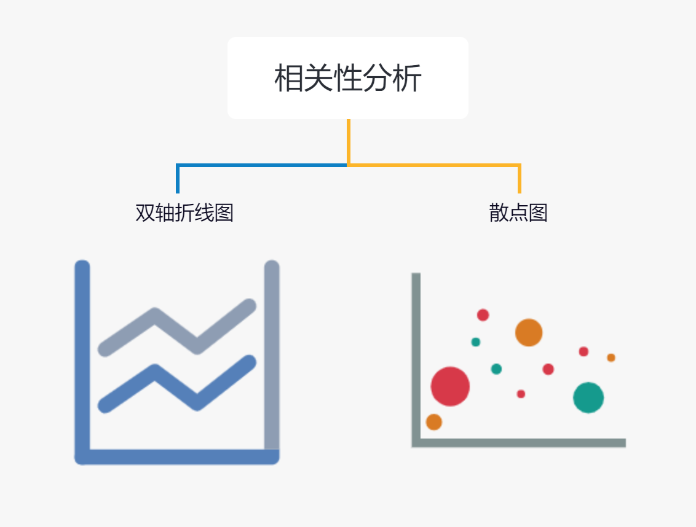
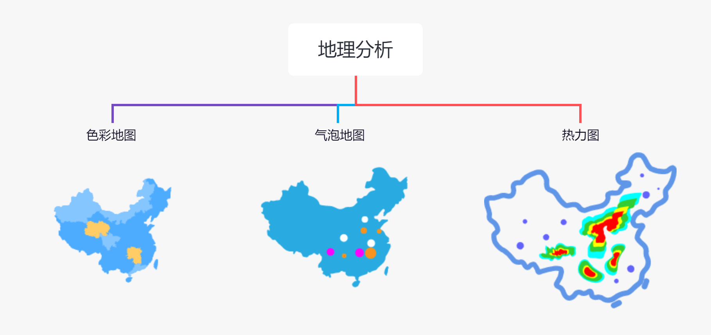

# 必知必会6大图表类型，带你轻松玩转数据可视化

在数据可视化中，常见的数据关系包含六大类型：排序、时间趋势、占比分析、分布分析、相关性分析、地理分析。 每一类问题都有一类最佳的可视化图表：

### 1、排序类

排序分析，通常用于比较不同类别的高低或多少。

### 2、时间趋势类

与时间有关的分析通常是查看随日期的变化趋势，比如，近七天的温度变化，日期有连续性，而折线图是体现连续性的最佳图表。

面积图、组合图，可看做折线图的延伸。

### 3、占比分析

占比，即部分与总体的占比。

它不像排序侧重数据之间的对比，而是侧重每一个类别在总体中所占的比例，因此需要有一个总体的表达，饼图、环形图用圆表示总体，角度表示部分。

当元素过多时，饼图看起来非常混乱，更适合用矩形树图。

树形图用面积代表大小。

### 4、分布分析

分布分析，用于分析样本或总体的分布特征。

拿学生成绩为例，以10分为一个间隔，查看不同分数区间内学生的分布情况。

分布分析可以用来分析核心数据的次数分布，挖掘用户分布规律，快速识别核心用户群体，是数据分析中常用的经典分析模型。

### 5、相关性分析

分布分析通常用于描述单一度量在不同详细级别的分布特征，无法描述不同度量之间的关联。例如，商品单价与商品销量是否相关？此时，需要进行相关性分析。

相关性分析，是指对两个或多个具备相关性的变量元素进行分析，从而衡量两个变量因素的相关密切程度。

### 6、地理分析

地理分析，用于处理与地理有关的分析，在地图上直观展示数据在位置上的分布。

上面按问题类型进行划分，下面介绍常见图表类型的适用场景及其优缺点：

### 1、条形图/柱状图

适用场景：一个维度的数据比较，单纯进行数据展示，排序类数据展示。

优点：人眼的直觉判断对长度最为敏感，可直观查看各个类别的数据差异。

缺点：不宜展示分类过多的场景。延伸图表：并排条形图、堆叠条形图。

### 2、折线图

适用场景：查看数据随日期的变化趋势。

优点：体现连续性的最佳图表。

延伸图表：双重折线图、多重折线图。

### 3、面积图

适用场景：既要体现变化趋势，又要体现数量值。

优点：结合了堆叠柱状图和折线图的双重优点，既能查看累计，又能体现变化趋势。

延伸图表：堆叠面积图、百分比面积图。

### 4、矩形树图

适用场景：元素过多时，体现元素占比分析。

优点：用面积代表大小，使用元素较多的场景。

### 5、饼图

适用场景：侧重每一个类别在总体中的占比，“圆”代表总体。

优点：元素较少时，简洁明了。

缺点：元素过多时，效果混乱。

图表延伸：玫瑰图。

### 6、环形图

适用场景：同饼图。

优点：人对角度的敏感度要远低于长度、高度、颜色等其他视觉要素，把饼图的角度判断改为环形的长度判断，缓解了角度判断带来的思考压力。中间空白位置显示数值，节约视觉空间。

### 7、直方图

适用场景：展示数据的分布特征，适用于用户分析、商品分析、订单分析等各种场景。

优点：直观反映数据分布情况，强调区间方面的精确性。

缺点：单一度量。

### 8、盒须图

适用场景：相比直方图，更强调宏观视角的数据特点。

优点：可用于检测并展现出数据中的异常值，可进行数据清洗，可以判断数据的偏态和尾重。

缺点：单一度量，且不能精确地衡量数据分布的偏态和尾重程度。

### 9、散点图

适用场景：描述不同度量之间的关联关系。

优点：描述度量与度量之间的关联关系。