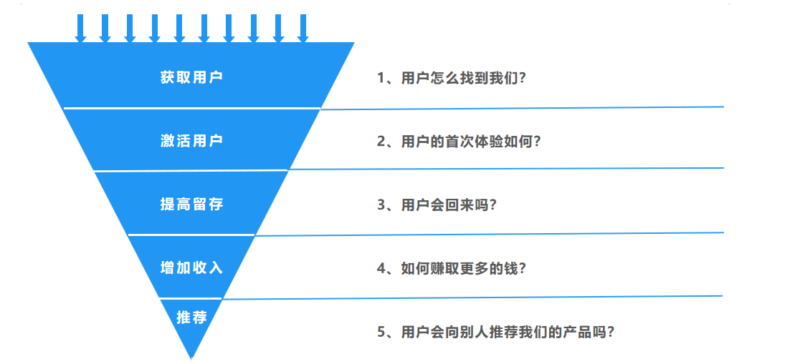

## 什么是AARRR分析法？

AARRR模型对应产品运营的5个重要环节，分别是获取用户（Acquisition）、激活用户（Activation）、提高留存（Retention）、增加收入（Revenue）、推荐（Referral）。

如果把产品看作一个鱼塘，使用产品的用户看作鱼塘里的鱼，AARRR模型的5个环节可以描述如下：

（1）获取用户：想办法给鱼塘里添加新的鱼，从而扩大鱼塘的规模；

（2）激活用户：让鱼塘里的鱼喜欢上这里的环境；

（3）提高留存：随着时间的推移，一部分鱼觉得鱼塘没意思，就离开跑到其他鱼塘里了，这些鱼就是流失用户；留下来的鱼就是留存用户。所以要想办法把用户留住；

（4）增加收入：鱼塘有盈利模式才能活下去，所以要想办法赚到更多钱；

（5）推荐：让更多的人知道这个鱼塘，才能扩大鱼塘的规模。对应产品，就是让用户推荐给其他人，才能让产品有更多新用户。

## AARRR分析法有什么用？

因为AARRR模型涉及用户使用产品的整个流程，所以它可以帮助分析用户行为，为产品运营制定决策，从而实现用户增长。

例如，使用其他分析方法定位到问题的原因是留存率低，那就可以参考AARRR模型里留存这一环节的策略来提高留存率。

## 如何使用AARRR分析法？
接下来，我们分别看下AARRR模型的每一环节如何使用。

### 1、获取用户
在“获取用户”这一环节，需要关注以下指标：

- **渠道曝光量**：有多少人看到产品推广的信息；
- **渠道转换率**：有多少人因为看到广告转换成用户；
- **日新增用户数**：每天新增用户是多少；
- **日应用下载量**：每天有多少用户下载了产品；
- **获客成本**：获取一个客户所花费的成本。

在互联网行业中，很多创业公司死掉并不是因为业务或产品不行，而是因为获客成本很高，并且没有办法降下来。

肖恩最初是在硅谷的Dropbox公司工作，这是一家做云存储业务的创业公司。这家公司开始时每获得一名用户的成本高达400美元，而它提供的付费服务每年是99美元。肖恩对低成本获客提供了两个建议：一是语言，二是渠道。

1）语言

语言就是指怎么说才能打动用户的心，例如广告的文案。2001年iPod问世时，广告语是“将1000首歌放在你的口袋里”，这么一句话就让用户知道了这个产品的魅力所在。

2）渠道

渠道是指产品投放在什么地方才能让用户看到。主要有四类渠道：搜索引擎、应用市场、付费渠道、口碑渠道。

不管是以哪种渠道推广来获取用户，本质上都是提高产品出现在用户面前的概率。例如，特斯拉的Model X的“鹰翼门”就是为了提高产品出现在用户面前的概率而设计的。在社交网络上，疯传着很多Model X的图片，这让更多人看到了特斯拉的这个产品。

获取用户时，需要注意降低用户参与的门槛。有的App好不容易把用户吸引过来，但是整个注册过程超级烦琐，用户一看太麻烦就跑了。社交软件WhatsApp（类似国内的微信）被facebook以190亿美元收购。WhatsApp将所有精力都用在了如何让自己的产品更加简单易用，不需要创建用户名或密码就能使用。由于它的简单易用，WhatsApp的口碑传播非常好。

### 2、激活用户

很多产品注册用户不少，但是打开率却不高。这一环节要做的是激活他们，让用户真正地使用产品。这就需要先弄明白产品的“啊哈时刻”。什么叫“啊哈时刻”？就是用户情不自禁地喜欢上产品亮点、发出赞叹的时刻。例如，网易云音乐在众多音乐软件中突围的亮点就是评论。用户打开软件，可能第一件事不是听歌，而是看评论。

要想激活用户，需要绘制一幅通往“啊哈时刻”的路径图。例如你负责的产品是个购物软件，在新用户体验到“啊哈时刻”之前，必须要完成这些步骤：下载App、注册账户、找到所需商品、放入购物车、填写邮寄地址、付款。在上述一系列环节中，到底用户停留在了哪一步，不再愿意继续下去？是搜不到想要的东西，还是创建账户太麻烦？可以计算每个节点用户的转化率（也就是完成每个步骤的用户比例），看用户是在哪个阶段流失的，以此来优化产品，改提高用户体验。

### 3、提高留存

用户被激活之后，第三个环节就是如何让用户变成回头客留存下来。留存的核心目标是让用户养成使用习惯。这一环节需要关注留存率指标。

如果产品留存率低怎么分析原因呢？可以用[群组分析方法](https://github.com/likuli/data-analysis-learning/blob/main/docs/analysis_method/8_group_analysis.md)来找到原因。

### 4、增加收入

这一环节的目标是如何赚到更多钱。收入分为服务收入、广告收入。服务收入是指产品里的付费服务，例如网易音乐的会员服务，用户开通会员才能听某些歌曲。广告收入是指依靠投放在产品里的广告而获取的收入，例如公众号发推广文案就可以带来广告收入。这一环节需要关注以下指标：

- 用来衡量业务总量的指标，例如成交总额、成交数量；
- 用来衡量每个人平均情况的指标，例如客单价；
- 用来衡量付费情况的指标，例如付费率，复购率。

这一环节有个概念需要重视，那就是“夹点”，它指的是损失潜在收益的地方。例如电商购物中，用户从选择商品到支付之间，很多人会中途放弃付费。要评估这些常见的夹点，分析用户在这些关键环节放弃的原因。

有段时间facebook发现用户流失比较严重得。之前用户注销账号的确认页面有一段提示：“你确定要注销吗？”如果用户点击“确认”按钮，就注销了。后来facebook改变了确认流程，在注销结束之前增加了一个页面，在上面把跟你互动比较紧密的五个朋友的头像列出来，然后配上文字：“你确定要注销吗？”潜台词就是，你如果要注销的话，你的朋友可就再也看不到你了，你再考虑一下？就是这个页面给facebook增加了3%的留存率。
### 5、推荐

前面的4个环节做完，就到了第5个环节—推荐，也叫病毒营销或者自传播。美国作家马尔科姆·格拉德威尔在《引爆点》这本书中用流行病来类比营销：引爆一种流行病需要三个条件—传染物本身、传染物发挥作用所需的环境、人们传播传染物的行为。

1）传染物本身

传染物本身是说要对自己的产品有足够的了解。试着问自己一个问题：我的产品是否真正解决了用户的痛点？如果你是写文章的，就要考虑你的文章能为用户带来哪些真正的价值；如果你是做餐饮的，则要考虑你的菜品是否真的为用户所喜欢。

2）传染物发挥作用所需的环境

传染物发挥作用所需的环境，也就是指用户所在的环境，对应前面讲的AARRR模型的第一环节“获取用户”。要思考使用产品的用户经常在哪些环境（如社区、大学等）出现。

3）人们传播传染物的行为

在对自己的产品有了深刻洞察，同时找了目标用户后，还要考虑人们会因为什么目的去分享你的产品，让更多的人看到你的产品。这个条件对应的就是AARRR模型的第五个环节—推荐，即病毒式营销。

这一环节需要关注的指标有**转发率、转化率、K因子**。

## 注意事项

用户不增长是创业公司做产品的魔咒。只要不增长，用户就会越来越少，例如人人网。AARRR模型可以帮助我们分析产品的用户行为，可以在不同阶段制定不同运营策略，从而实现用户增长。可以先记住AARRR模型的5个环节，然后在实际业务中灵活使用。

