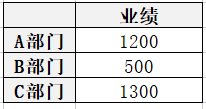
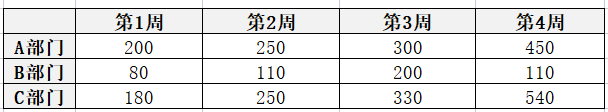
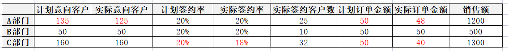
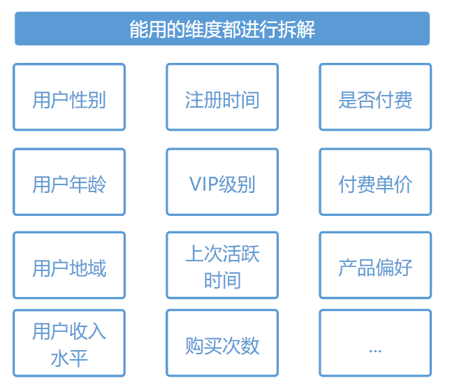
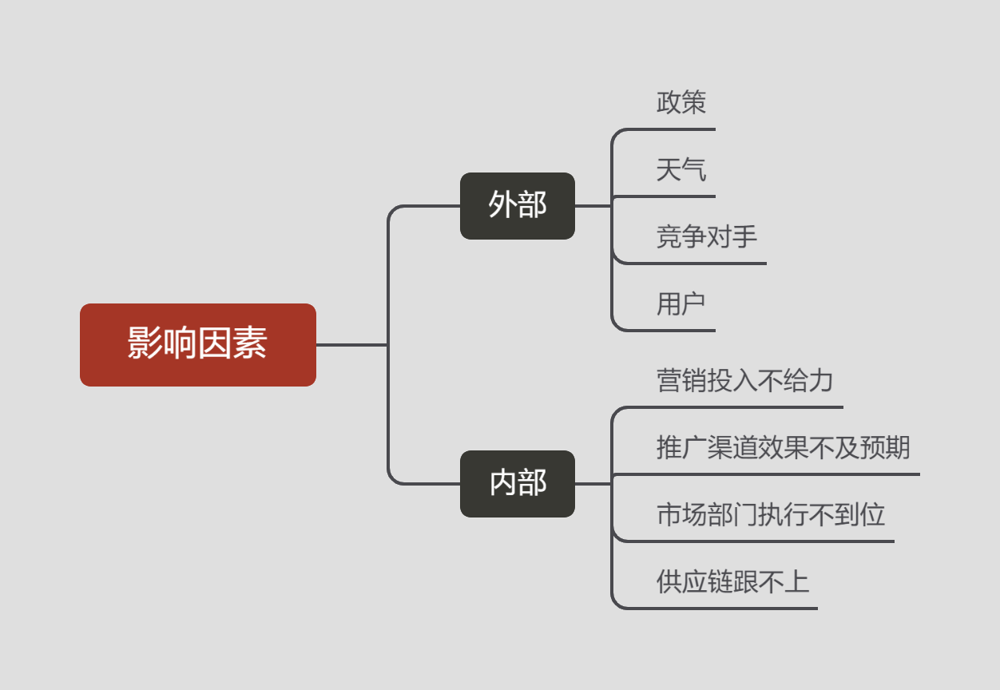
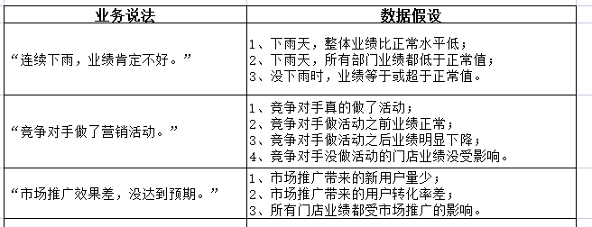

## 什么是多维度拆解分析法

多维度拆解分析法，通过不同的维度观察同一组数据，从而洞查数据异动背后的原因

## 多维度拆解的适用场景

**对单一指标的构成或比例进行拆解分析**，这种场景往往适用于像分栏目的播放量和新老用户比例等等。

**对业务流程进行拆解分析**，一般适用于从不同渠道浏览到添加购物车到购买的这种全局的转化流程，像有些跨区域的产品，不同的区域活动的效果自然不同，这时候我们就可以从不同省份的活动情况来进行分析。

**对需要还原行为发生的场景时进行拆解分析**，比较适用于一些直播类的产品，比如需要去观察打赏主播的等级、性别，来自哪个频道进行多维度的拆解。

## 如何使用多维度拆解分析

step 1： 是什么？

对于多维度拆解分析方法要理解两个词：一个是“维度”，即我们日常生活中说的角度；另一个是“拆解”，其实就是做加法，问题=维度1+维度2+…

step 2： 有什么用？

有两个作用。

第一个作用，遇到一个复杂问题，不知道怎么解决，我们可以用多维度拆解分析方法将一个复杂问题变成可以解决的子问题。这背后的原理其实就是我们之前讲过的[逻辑树分析方法](https://github.com/likuli/data-analysis-learning/blob/main/docs/analytical_method/2_logical_tree_analysis.md)。

第二个作用，只看数据整体，我们可能注意不到“数据内部各个部分构成的差异”，所以需要拆解数据来分析。

step 3：怎么用？

一般会从指标构成或者业务流程的维度来拆解。

（1）从指标构成来拆解：分析单一指标的构成。例如单一指标为用户，而用户又可以拆解为新用户、老用户。

（2）从业务流程来拆解：按业务流程进行拆解分析，例如不同渠道的用户付费率。

step 4：注意事项

要注意“辛普森悖论”，在有些情况下，考察数据整体和考察数据的不同部分，会得到相反的结论。使用多维度拆解分析方法，可以防止“辛普森悖论”。

## 典型案例

某公司上月销售额3000万。这就是一个指标，没有拆分维度。如果加了分类维度，效果如下：

再加一个时间维度，效果如下：

比起只看总数，多维度拆解能更确定的定位数据，进而分析问题原因。假如上月目标销售额是3500万，发现实际与目标差500万，可我们不知道为什么不达标，这时候需要拆细一点，比如：

添加分类维度，看哪个部门没做好：

如果单纯看销售额差500万，什么问题也解决不了，对数据进行拆解以后，我们发现A、C两个部门是公司业务大头，其中C部门上月业绩表现更差。

添加过程指标，看哪个环节出了问题：

增加过程指标和分类维度，能更准备的定位问题，让简单的结论显而易见。但正因为简单，很多数据分析人员容易把业务口中的多维度，直接理解成“维度多”，听到做数据分析，就是拆、拆、拆。

下面是典型的基于数据做的多维度拆分结果：

但业务真正需要的多维度，是这个意思吗？

业务脑子里装的是不是数据库里的表结构，不是数据有哪些字段，而是一个个具体的问题。当业务看到上月销售目标没有完成时，脑子里的多维度是这样的：

此时发现，单纯看数据根本回答不了业务的问题。

以客户意向太少为例，到底是竞争对手发力，还是产品没做好，还是营销活动没跟上导致的，根本说不清楚，自然解决不了业务问题。

所以，真正的多维度分析，关注的不是数据的计算能力，而是业务的策略能力。具体来说包括三方面内容：

（1）把业务上的理由，转化为数据上论证。

（2）堵住借口：业务不要总试图甩锅，集中精力想能干点啥。

（3）找到症结：在一堆影响因素里，找到最关键的那个，集中发力。

注意，这三件事是有顺序的：

（1）先把数据论证方式列清楚，避免大家放空炮（数据不能论证的理由就闭嘴，是个非常好的议事规则）。

（2）之后先堵借口，找借口并不能解决问题，因此先把各种逃跑路线堵上。

（3）最后再集中想办法，想办法的时候，从大到小，从粗到细，先搞大问题。

所以，完整的多维度拆解分析法，可以分5步进行：

第一步，对业务提出的说法进行分类，对每一类问题，进行分析假设，把业务理由转化为数据逻辑，用数据说话，例如：

第二步：优先排除借口。

借口往往产生于宏观因素、外部因素、队友因素，而能堵住接口的关键在于——证伪。

证伪最好的办法是举例法，同样是下雨，为什么别人的业绩不受影响？同样面对竞争对手的促销，为什么别人的业绩能保持住？

在堵住借口的同时，也指出了解决问题的出路，给出具体的学习对象，可以极大的激发业务思考对策，从而达到双赢的效果。

第三步，解决白犀牛，剔除明显的重大影响。

比如监管政策、公司战略、重大外部环境等等因素，确实会对企业经营起到重大作用，并且这些因素是普通小员工只能接受，不能改变的。

如果业务真的把责任推给大环境，那就要用数据证明符不符合趋势。

第四步，解决黑天鹅，剔除明显突发事件

如果真的发生突发事件，很容易找到根源，例如，正向的有，促销活动、新产品上线等，负向的有，恶劣天气、系统宕机、突发事件等。

第五步，按分工锁定问题点再谈细节

解决了大问题以后，想讨论更细节的问题就得锁定部门，先定人再谈计划。

因为部门职责固定，所以一般先找到问题环节，再细看这个环节哪些问题比较大，就能锁定责任部门。所以分析时不能胡乱拆解，要么先环节再细分维度，要么先细分部门后拆解环节，这样容易落实责任。

