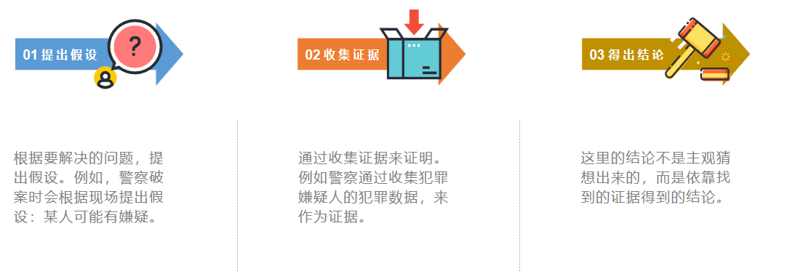
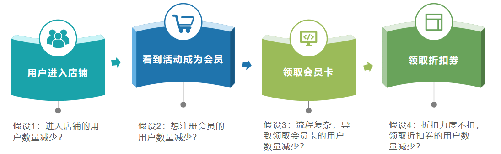
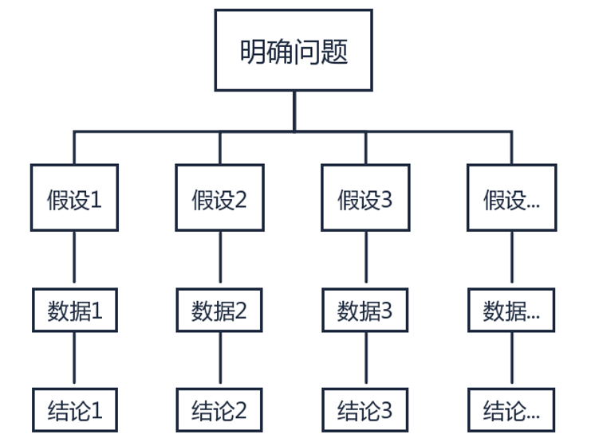

## 什么是假设检验分析法
假设检验分析方法底层思想其实很简单，就是逻辑推理。

这个逻辑推理，在我们生活中无处不在。例如我们看的《神探狄仁杰》《白夜追凶》《唐人街探案》这些破案片，就会发现，剧中的破案高手都有一个破案套路，那就是先假设某个人是嫌疑人，然后找证据，如果有足够的证据证明该嫌疑人犯罪，才宣判嫌疑人有罪。

同样在现实中，法官在审理案件的过程中，也首先会假设被告方无罪，而指控方的工作就是搜集证据来说服法官或陪审团，最后得出罪犯有罪的结论。

我们常说某个人心思细腻、逻辑严谨，其实我们也可以做到，那就是掌握逻辑推理的方法：假设检验分析。

假设检验分析方法是一种使用数据来做决策的过程。 其分析步骤如下图：

## 假设检验分析法有什么用？

假设检验分析法的本质就是逻辑推理，所以使用该方法，能提升我们的逻辑思维能力。

假设检验分析法可以用于归因分析，即分析问题发生的原因。

## 如何使用假设检验分析法？

前面我们提到假设检验分析方法的步骤分为3步：提出假设、收集证据、得出结论。

那么现在问题就来了，我们建立假设时，很容易依赖之前的经验做出假设，这会无意识地排除一些重要的假设。 如何客观地提出假设呢？

通常用三种方法来避免假设遗漏的问题：

#### （1）按用户、产品、竞品三个维度提出假设
我们可以按用户、产品、竞品这3个维度提出假设，来检查提出的假设是否有遗漏。这3个维度分别对应公司的3个部门：用户对应运营部，产品对应产品部，竞品对应市场部。这3个维度有助于在发现问题原因以后，对应落实到具体部门上，有利于把问题说清楚。

从这三个维度，可以提出三种假设：

假设用户有问题：可以从用户渠道来源进行拆解分析，或根据用户使用产品的流程来分析。

假设产品有问题：研究产品功能是否稳定，近期是否上线新的功能，产品功能是否满足用户需求等进行分析。

假设竞品有问题：研究竞品是否搞促销活动等。

#### （2）按4P营销理论提出假设

4P营销理论产生于20世纪60年代的美国，它是随着营销组合理论的提出而出现的。营销组合实际上有几十个要素，这些要素可以概括为4类：产品、价格、渠道、促销。

（1）产品（Product）：公司提供给目标市场的有形或无形产品，包括产品实体、品牌、包装、样式、服务、技术等；

（2）价格（Price）：用户购买产品时的价格，包括基本价格、折扣价格、付款期限及各种定价方法和定价技巧等；

（3）渠道（Place）：产品从生产公司到消费用户所经历的销售路径。

（4）促销（Promotion）：是指企业利用各种方法刺激用户消费，来促进销售的增长。包括广告、人员推销、营业推广等。例如买一送一、过节打折等。

为了寻找销售业绩下降的原因，可以利用4P营销理论从4个维度提出假设，如下图：

#### （3）按业务流程提出假设

4P营销理论是从公司角度出发研究产品的。还可以从用户角度出发去研究产品，也就是从用户使用产品的业务流程来检查提出的假设是否有遗漏。

例如，某线上店铺最近给新会员的折扣券的领取率降低，原因是什么呢？可以先画出业务流程，根据业务流程，提出以下假设：

假设1：进入店铺的用户减少？例如流量减少或者推广引入了大量低质的用户。

假设2：想领取会员卡的用户减少？例如店铺增设了不用领卡就能领取的其他折扣券，分散了用户的注意力。

假设3：注册会员流程过于复杂，用户失去耐心，导致注册会员的数量减少。

假设4：成为会员后，想领折扣券的用户减少？例如折扣券需要达到某个门槛才能使用，门槛设置太高对用户失去吸引力。

从业务流程提出假设，这里其实是用到了我们之前讲过的[多维度拆解分析方法](https://github.com/likuli/data-analysis-learning/blob/main/docs/analytical_method/4_multidimensional_analysis.md)。

## 注意事项

（1）结论不是主观猜测，而要依靠数据去证明结论；

（2）假设检验的三个步骤是一个不断重复的过程，在得出结论后，要多问为什么，然后用数据去验证结论，不断重复假设检验的过程，直到找到问题根本原因；

（3）假设检验分析法通常与其他分析法配合使用；

（4）开始分析之前，为了缕清思路，可以参考下图将问题、假设、数据罗列出来：

