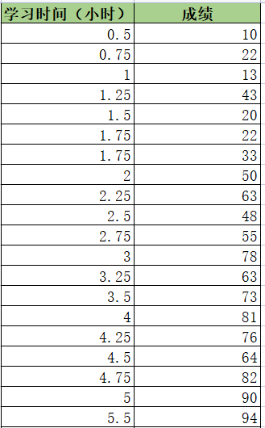
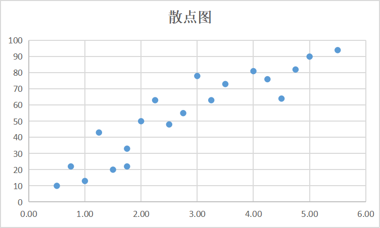

## 什么是相关性分析法？
谷歌首席经济学家哈尔·瓦里研究发现，某时间段内，如果更多人搜索“八成按揭贷款”，或者“涨幅”、“涨价的速度”，这个地区房价就会上涨。如果更多人搜索“快速卖房的流程”或者“按揭超过房价”，这个地区房价就会下跌。

也就是说，用户在搜索引擎里搜的信息和这个地区的房价有相关关系。

当我们研究两种或两种以上的数据之间有什么关系的时候，就要用到相关性分析。

如果两种数据之间有关系，叫做有相关关系；如果两种数据之间没有关系，叫做无相关关系。

## 相关性分析法有什么用？
相关性分析的作用有以下4点：

1、研究两种或两种以上数据之间的关系，或者某个事件受其他因素影响时，可以试用相关性分析。

在工作中我们常被问到，某功能对产品有多少贡献或者说有什么影响。例如微信读书，评估“想法”这个功能，对用户留存的影响度。这时候就可以使用相关分析，研究功能和产品之间有什么关系。

2、解决问题时，相关性分析可以帮我们扩展思路，将视野从一种数据扩展到多种数据。

例如，在分析“为什么销量下降”的过程中，可以研究哪些因素和销量有关系，例如产品价格、售后服务等。使用相关分析，可以知道哪些因素影响销量，哪些对销量没有影响，从而快速锁定问题原因。

3、相关分析通俗易懂。

这在实际工作中很重要，因为数据分析结果需要得到他人的理解和认可，要方便大家沟通。很多分析方法看上去高端，但没相关知识的人很难理解。而相关分析通俗易懂，不需要向解释什么是“相关”的含义及分析结果的意义，对方也能轻松理解。

4、相关分析与其他分析方法结合使用，帮助我们进行深入分析。

## 如何使用相关性分析法？

先看一个例子，下表记录了20名学生为考试花费的学习时间和取得的成绩。现在想知道学习时间和成绩之间有什么关系。

数据放在表格，很难发现两种数据之间存在什么关系，需要想办法将数据放到图形上。我们用横轴表示学习时间，纵轴表示成绩，然后将每个学生的数据画到图中，如下图所示：

图中一个点表示一个学生的数据，例如图中的点A，表示这名学生的学习时间是5.5小时，成绩是93分。这样的图叫散点图。散点图可以直观显示出两种数据之间的相关关系。

那么，两种数据之间有多大程度的相关关系呢？

**相关系数**就是用来衡量两种数据之间的相关程度的，通常用字母r来表示。相关系数有两个作用：

（1）相关系数的大小可以表示两种数据的相关程度。

好比给两部电影打分，一个8.6分，一个7.8分，两部电影都是好电影，但如果比较一下，肯定8.6分的更好。根据相关系数的大小可以进行相关程度的比较。

（2）相关系数数值的正负可以反映两种数据之间的相关方向，也就是说两种数据在变化过程中是同方向变化，还是反方向变化。

相关系数的范围是-1～1。-1、0、1这三个值是相关系数的极值。

解释一下相关系数的3个极值：

假如有两种数据a和b，把这两种数据画在散点图上，横轴用来衡量数据a，纵轴用来衡量数据b。

如果相关系数=1，数据点都在一条直线上，表示两种数据之间完全正相关，两种数据是同方向变化。也就是数据a的值越大，数据b的值也会越大。

如果相关系数=-1，数据点都在一条直线上，表示两种数据之间完全负相关，两种数据是反方向变化。也就是数据a的值越大，数据b的值反而会越小。

如果相关系数=0，表明两种数据之间不是线性相关，但有可能是其他方式的相关（例如曲线方式）。

如果相关系数>0，说明两种数据是正相关，是同方向变化，也就是一种数据的值越大，另一种数据的值也会越大；如果相关系数<0，说明两种数据是负相关，是反方向变化，也就是一种数据的值越大，另一种数据的值反而会越小。

相关系数的绝对值越大，说明两种数据的相关程度越高。

所以，相关分析就是得到相关系数，相关系数有两个作用：

（1）相关系数的数值大小可以表示两种数据的相关程度。一般相关系数的值大于0.6或者小于-0.6，表示两种数据之间高度相关；

（2）相关系数的数值正负可以反映两种数据之间的相关方向。

通常在做相关分析的时候，会在散点图上给出相关系数。还介绍了一种应用相关分析的模式，就是找出哪些因素与分析目标相关。

## 注意事项
需要注意的是**相关关系不等于因果关系**。

如何判断两种数据之间是相关关系，还是因果关系呢？

要用到“**单变量控制法**”，也就是控制其他因素不变，只改变其中一个因素，然后观察这个因素对实验结果的影响。
什么时候需要相关关系，什么时候需要因果关系呢？

大部分时候无法找到因果关系，但是仅仅知道相关关系也能帮助我们。对于有些问题，需要找出事件背后的原因。这时候就需要先通过研究发现相关关系，然后再进一步去找出背后的原因，找出事件之间的因果关系。

