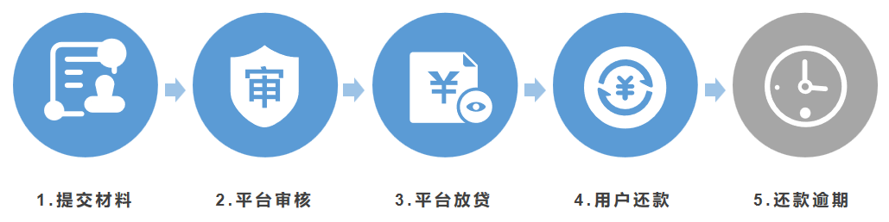
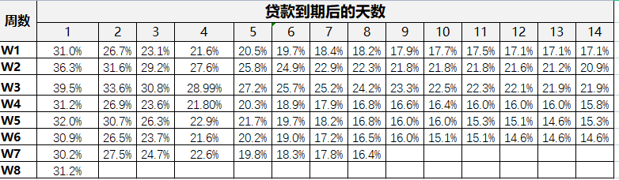
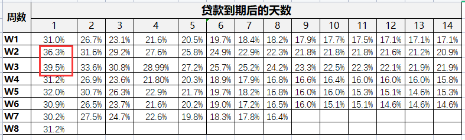
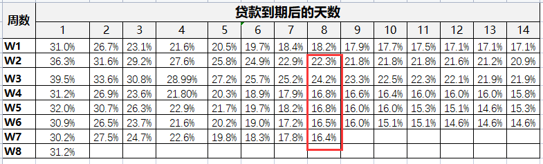

## 什么是群组分析法？
群组分析方法，是按某个特征将数据分为不同的组，然后比较各组数据。

说白了就是对数据分组然后来对比。

这个分析方法在生活中经常可见，例如，在上体育课的时候，体育老师考虑到男生和女生的运动项目不一样，会把男生分为一组打篮球，女生分为一组跳绳。这其实是按性别对学生进行了分组。

## 群组分析法有什么用？

产品随着时间发布新的版本，产品改版的效果如何？版本更新后用户是增长，还是流失？像这类问题，就需要将用户按时间分组，然后比较不同组的用户留存率。所以，群组分析方法常用来分析用户留存率（或者流失率）随时间发生了哪些变化，然后找出用户留下或者离开的原因。

留存问题中，通常按用户开始使用产品的月份来分组，例如用户注册的那个月或者第1次购买的那个月。

分组后，观察每组用户的留存率随着时间发生了哪些变化，例如1个月后留存率是多少，2个月后留存率是多少。对留存率高的用户组，分析他们为什么留存；对留存率低的用户组，分析他们为什么流失。

## 如何使用群组分析法？

先使用群组分析方法，找到留存率低或留存率高的组；然后使用[假设检验](https://github.com/likuli/data-analysis-learning/blob/main/docs/analysis_method/6_hypothetical_test_analysis.md)、[相关分析](https://github.com/likuli/data-analysis-learning/blob/main/docs/analysis_method/7_correlation_analysis.md)等方法，研究为什么这些组留存率低或留存率高。找到原因以后，就可以对应地优化产品。

当群组分析表格里的数据比较多的时候，直接分析起来比较困难，这时可以把数据绘制成折线图，这样就可以很容易地发现数据发现了哪些变化。

## 贷款逾期分析案例

贷款流程：①贷款申请人填写申请资料；②贷款平台审核；③如果通过审核，贷款平台会把贷款打入申请人的银行账户，也就是放款；④在贷款到期时，申请人需要按时还款。

如果申请人没有按时还款，那么贷款平台的催收人员会提醒还款。没有按时还款的用户，叫作逾期用户。

逾期率是贷款到期的用户里未还款用户的占比。例如，有1000名用户的贷款到期，过了还款日期，有100人没有还款，那么逾期率就是100/1000=10%。

平台放款后，万一用户不还款怎么办？作为贷款平台，就要考虑这种风险。这时可以使用群组分析方法来分析放贷后，用户的还款表现。

例如某贷款产品的期限是7天，在产品发放过程的第4周开始，公司为了降低逾期率，调整了审核条件。

为了检验调整后的审核条件是否有效，需要分析审核条件变化前后用户逾期率的变化。为此使用群组分析方法来观察逾期率随着时间发生了哪些变化。

该产品的账龄分析如下表所示，表格中第一列是按每周（7天贷款期限）的还款日期分组，例如W1是“第1周的贷款”，W2是“第2周的贷款”。每一行是这一组用户贷款到期后的第几天，例如“1”表示的是贷款到期后的第一天，以此类推。

单元格里的数据是逾期率，也就是当前天数未还款的用户的占比。例如W1（第1周）贷款到期后的第1天对应的数据是31%，表示逾期率是31%，也就是第1周放款的用户当中，在逾期1天时仍未归还的用户占31%。

表格制作时间是第8周贷款到期后的第2天，而此时我们还无法获取第2天及后续的数据，因此W8这一行只有一个数据。同理，此时第7周也只有8天的数据，剩余数据暂时还无法获取。

从表中我们可以获得哪些信息呢？

首先，看表方框中W2和W3对应的逾期率分别是36.3%和39.5%，而这一列其余的逾期率几乎都是31%左右。

通过比较不同组的数据，发现相对于W1而言，W2和W3的第1天逾期率明显地升高了。随后产品调整了风控策略，W4的逾期率下降为31.2%，恢复到了正常水平。

其次，观察表的右半部分。表2-13方框中的数据是从W2到W7的第8天逾期率。从W2到W7，整体呈现下降趋势，从22.3%下降到了16.4%，从第4周开始，用户逾期8天的占比有明显下降。

不仅仅是第8天，对第8天以后每周的逾期率进行分析，也可以得出这一结论。这说明在调整了风控策略以后，不仅到期后第1天逾期率有所下降，后续天数的逾期率同样也有所下降。

通过上述分析，可以得出结论：

在调整风控策略后用户逾期率有了显著的下降，这证明了风控策略的调整是有效的。

## 注意事项

使用群组分析方法需要注意如何分组，除了按时间分组，还可以根据具体的业务场景来确定。

