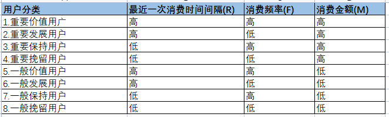
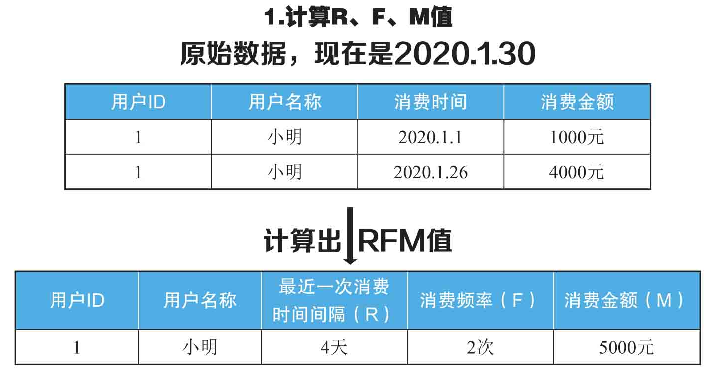
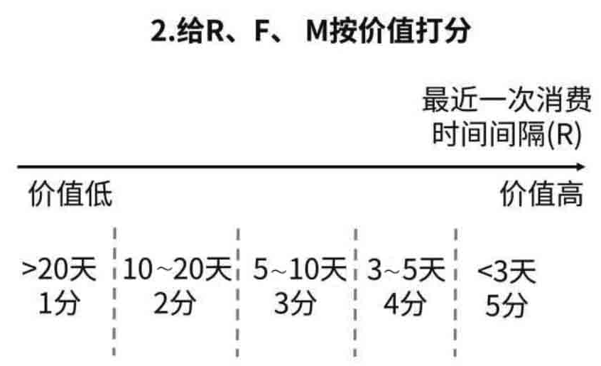
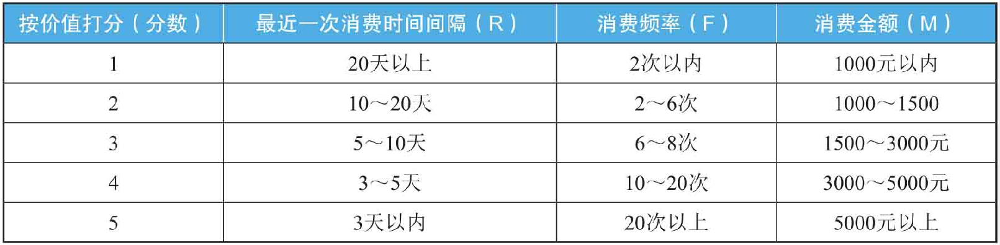
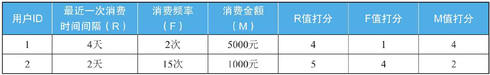
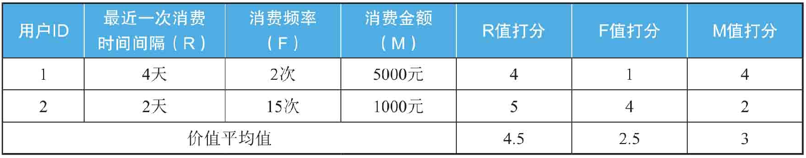
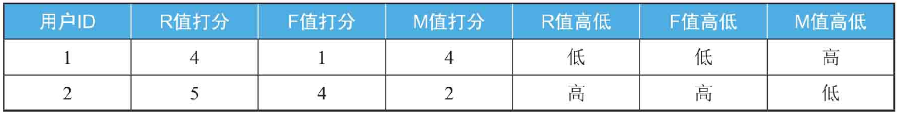

# RFM分析法

## 什么是RFM分析法？

RFM是3个指标的缩写：最近1次消费时间间隔（Recency）、消费频率（Frequency）、消费金额（Monetary），通过这3个指标对用户分类的方法称为RFM分析方法。

举例说明3个指标是什么意思。假如小明是某家店铺的用户，今天是本月30号。

（1）最近1次消费时间间隔（R）是指用户最近一次消费距离现在多长时间了。

小明最近1次在店铺买东西是这个月26号，上一次消费距离现在（这个月30号）过去了4天，所以小明的最近1次消费时间间隔是4天。

（2）消费频率（F）是指用户一段时间内消费了多少次。

如果对“一段时间”的定义是最近30天，发现小明最近30天在店铺消费了2次（小明在1号、26号进行了消费）。

（3）消费金额（M）是指用户一段时间内的消费金额。

如果对“一段时间”的定义是最近30天，发现小明最近30天总共在店铺消费5000元。

这3个指标针对的业务不同，定义也不同，要根据业务来灵活定义。各指标特征如下：

- 最近1次消费时间间隔（R），最近一次消费时间越短，也就是R值越小，用户价值越高。
- 消费频率（F），购买频率越高，也就是F的值越大，用户价值越高。
- 消费金额（M），消费金额越高，也就是M的值越大，用户价值越高。

根据上述特征，RFM针对用户分类的规则如下：

## RFM分析法的作用是什么？

通过RFM分析法可以把用户分为8类，然后对不同用户使用不同的营销策略，从而把有限资源发挥到最大效果，最终实现精细化运作。例如，针对第1类重要价值用户，这类用户最近一次消费时间较近，消费频率也高，消费金额也高，要提供VIP服务。

## 如何使用RFM分析法？

**第1步：** 计算R、F、M的值

要得到R、F、M这3个指标，一般需要数据的3个字段：用户ID或者用户名称、消费时间、消费金额。从这3个字段可以计算出R、F、M这3个指标。例如：

**第2步：** 给R、F、M值按价值打分

注意这里是按指标的价值打分，不是按指标数值大小打分。对于最近1次消费时间间隔（R），上一次消费离得越近，也就是R的值越小，用户价值越高。

将R、F、M 3个指标分别按价值从小到大分为1～5分。上述案例里，对于最近1次消费时间间隔（R），大于20天的打1分，10～20天的打2分，5～10天的打3分，3～5天的打4分，3天以内打5分。

实际业务中，如何定义打分的范围，要根据具体的业务来灵活掌握，没有统一的标准。

根据打分规则，可以计算出的R、F、M值进行分类，在后3列填上对应的分值。

**第3步：** 计算价值平均值

分别计算出R值打分、F值打分、M值打分这3列的平均值。

**第4步：** 用户分类。

在表格里增加3列，分别用于记录R、F、M 3个值是高于平均值，还是低于平均值。

如果一行里的R值打分大于平均值，就在R值高低列里记录为“高”，否则记录为“低”。F值、M值同理。

## 注意事项

（1）R、F、M指标在不同业务下定义不同，要根据业务灵活应用。

举个例子，如果你是滴滴打车的一名运营人员，用RFM分析方法对用户进行分类，你会如何定义R、F、M这3个指标呢？

针对这个业务，R可以定义为“上一次打车距离现在多少天”，F可以定义为“过去30天的打车次数”，M可以定义为“过去30天内打车的总金额”。

为什么F不是“历史打车总数”呢？

因为滴滴打车满足的是用户高频的短途出行需求，如果用户连续一个月未使用，即可定义为流失用户，所以“一段时间”可以定义为“最近30天”。如果是滴滴的代驾或者货车业务，是低频的需求，可以把“一段时间”定义为“一年或者1个季度”。

（2）R、F、M按价值如何确定打分规则？

分值一般分为1～5分，也可以根据具体业务灵活调整。每个分值的范围要根据业务来定，就好比你在开车，车速控制在哪个范围，可以根据路况灵活把握。

此外，RFM打分的规则可以与业务部门沟通，进行头脑风暴。或者使用聚类的方法对R、F、M的值进行分类，然后给每个类别打分。

（3）R、F、M这三个指标可以灵活和其他分析方法结合使用。

例如，某个店铺做活动以后，希望对老用户的表现做复盘总结。可以使用[对比分析方法](https://github.com/likuli/data-analysis-learning/blob/main/docs/analysis_method/5_comparative_analysis.md)来比较该店铺今年和去年同样活动中老用户的复购情况。

可以使用R值来衡量老用户的复购情况。R值定义为老用户最后一次消费时间间隔，这样R值可以反映老用户的活跃程度和复购周期。可以简单理解为R值越小，用户越活跃、复购周期越短。

