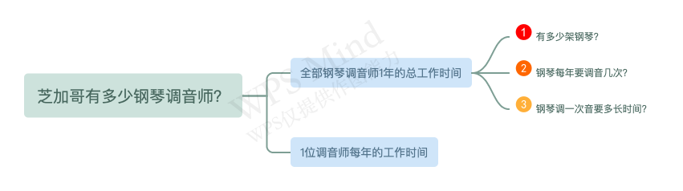
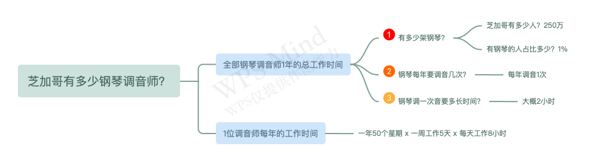

## 什么是逻辑树分析法？

逻辑树分析法，通常是将问题中涵盖的所有子问题，没有疏忽、没有遗漏的进行分层罗列，从最高层向下逐步扩展、逐渐细化，直到最终找到解决问题的方法。

其本质是，**把复杂问题拆解成简单子问题**。

## 逻辑树分析法的作用是什么？

（1）复杂问题简单化，帮助我们理清思路。

（2）找出问题所有相关项，确保问题完整性。

（3）减少重复与无关思考，提升效率。

## 如何使用逻辑树分析法？

不管是生活中还是工作中，我们经常会使用逻辑树分析法来分析问题。

例如，我们给自己制定年度计划，因为要做的事情很多，思路很零散。为了理顺思路，可以使用逻辑树分析法，把年度计划这个复杂问题拆分成技能学习、读书、健身、旅行这几个子问题。

技能学习是为了储备技能，想要零基础学习数据分析，可以进一步拆解为学习业务指标、分析方法、Excel、SQL、Python等。这样一步一步把年度计划拆解成一个一个的子问题，年度学习计划自然就会出来。

逻辑树分析法的操作步骤如下：

step1：明确问题：明确需要解决的问题，将原本模糊笼统的问题，确定为一个个具体的问题。

step2：分解问题：将问题拆解成一个个相互独立、更加细致的子问题。

step3：剔除次要问题：对各个子问题依次分析，剔除不重要的部分。

step4：进行关键分析：针对关键驱动点，集思广益找出解决方案。

step5：制定解决方案：将思维过程转化为可执行计划。

## 经典案例

逻辑树分析法是由科学家费米提出来的，这种分析问题在面试中经常用到，例如：北京有多少辆电动汽车？某煎饼摊一年能卖出多少个煎饼？深圳有多少个产品经理？一个成年人有多少根头发？

这类估算问题，被称为"费米问题"。

这类问题能把人清楚的划分为两类：一类是具有文科思维的人，他们擅长赞叹和模糊想象，主要依靠的是第一反应和直觉，例如小孩；一类人是具有理科思维的人，他们擅长通过逻辑推理、分析解决具体问题。理科思维不是天生就有的，需要经过后天长期训练。

面试官常常通过费米问题，考察我们面对问题的分析思路。

回答费米问题，最常用的就是逻辑树分析法，将一个复杂问题拆解成简单的子问题，然后逐一攻破。

有人曾问费米："芝加哥有多少钢琴调音师？"

对于这个问题，费米使用逻辑树分析法进行拆解。 钢琴调音师数量 = 全部钢琴调音师1年的总工作时间 / 1位调音师每年的工作时间。所以，可以把这个人问题拆解成两个子问题：

对于全部钢琴调音师1年的总工作时间，又可以拆解成三个子问题：

现在我们一个个去解决这些子问题，如下图所示：

我们把4个子问题进行汇总，全部钢琴调音师总工作时间一共是10万小时，调音师每年工作1600个小时，我们用全部调音师总工作时间，除以一位调音师每年的工作时间，就得到了62.5，四舍五入，费米预测芝加哥大概有63位调音师。

这个答案准不准呢？费米最后找到芝加哥调音师的名单，上面一共有83人，但有不少人的名字是重复的。所以费米估算出来的结果已经非常接近事实了。

## 注意事项

逻辑树分析法在解决业务问题时，经常不是单独使用，会融合在其他分析方法里，辅助解决问题。