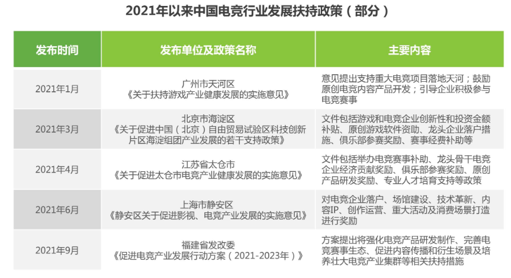
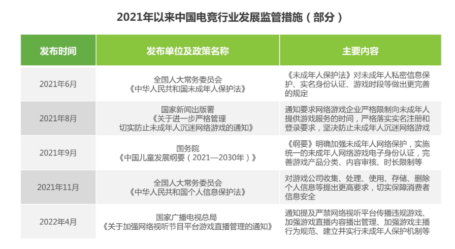
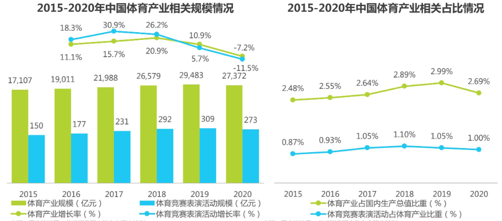
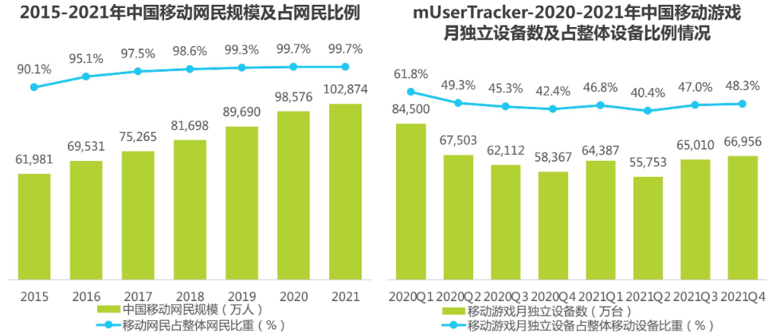
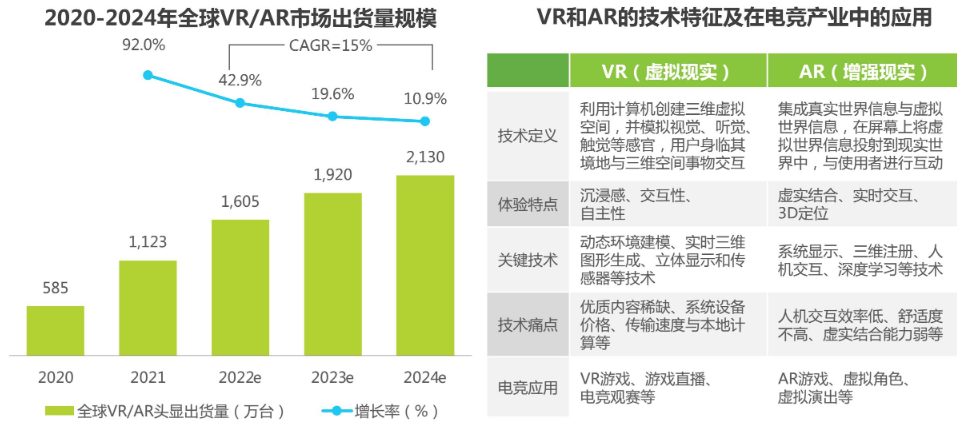

## 什么是PEST分析法？
PEST分析法，又叫行业分析法。

PEST分析法，从政策（Policy）、经济（Economy）、社会（Society）、技术（Technology）四个方面分析行业发展的宏观环境。

通常适用于以下场景：个人职业规划，思考哪个行业更好；公司分析行业竞争环境，制定发展规划；公司面对重大问题，分析行业问题等。

具体内容如下：

`政治环境`：指一个国家或地区的政治制度，体制，方针政策，法律法规等方面，这些因素常常影响着企业的经营行为，尤其是对企业长期额度投资行为有着较大的影响。

`经济环境`：指企业在制定战略过程中须考虑的国内外经济条件，宏观经济政策，经济发展水平等多种因素。

`社会环境`：指组织所在社会中成员的民族特征、文化传统、价值观念、宗教信仰、教育水平以及风俗习惯等因素。

`技术环境`：指企业业务所涉及国家和地区的技术水平，技术政策，新产品开发能力以及技术发展的动态等。

## 典型案例

中国电竞行业研究报告（来源：艾瑞网）。

#### （1）政治
从电竞行业行业的政策扶持环境来看，2021年以来，全国各地仍在持续加码电竞产业扶持力度，包括支持重大电竞赛事落地举办、电竞场馆建设、电竞人才培养以及更多电竞衍生产品扶持等。除了北上广深这些一线城市，更多二三线城市也纷纷出台相关扶持政策，推动电竞城市在全国范围内的建设。

从电竞行业发展的政策监管环境来看，2021年以来，国家监管部门陆续出台了多个政策，对游戏及电竞产业提出更高的规范化要求，包括未成年人保护、消费者权益保护、直播内容规范等多方面监管，规范中国电竞产业健康化发展。

#### （2）经济

自国务院2014年10月印发《关于加快发展体育产业促进体育消费的若干意见》以来，中国体育产业增速加快，在国内生产总值中的比重逐步增加，在2019年占比已接近3%。随着传统体育赛事商业化进程加速，体育竞赛表演活动作为体育产业的重要组成部分，占体育产业的比重也越来越大。尽管新冠疫情对全球体育产业造成了较大冲击，但随着《体育产业统计分类(2019)》将电竞运动加入到职业体育竞赛表演活动之中，未来电竞有望成为后疫情时代下体育产业发展的全新增长点，并对国内经济发展产生一定的推动作用。

#### （3）社会

根据CNNIC发布的《第49次中国互联网络发展状况统计报告》显示，截至2021年12月，中国移动网民规模达10.29亿人，网民使用手机上网的比例为99.7%，而使用台式电脑、笔记本电脑、电视和平板电脑上网的比例分别为35.0%、33.0%、28.1%和27.4%，手机已成为中国网民最主要的上网方式。根据艾瑞UserTracker多平台网民行为监测数据库数据显示，2020年以来，随着复工复产的有序进行，移动游戏在整体用户中渗透率有所回落，但渗透率始终保持在40%以上，用手机玩游戏，已成为中国移动网民最普遍的在线娱乐方式之一，各游戏类型中MOBA类和射击类等电竞游戏深受用户欢迎。

#### （4）技术

VR/AR技术快速发展，有望推动电竞产业革新。2021年以来，元宇宙引发了社会各界的广泛探讨，国内外互联网巨头纷纷加大元宇宙领域投入力度，其中VR和AR是元宇宙的重要前端设备。VR和AR与众多领域均可结合，而游戏及电竞是其重要的应用场景，依托5G、VR和AR技术的融合，空间和时间、线上和线下的界限被打破，打造出现实与虚拟交融的场景:游戏可以利用VR为用户提供更加身临其境的游戏体验;电竞赛事可以利用AR以现实环境多样性来提升电竞观赛的趣味性等。正如《头号玩家》和《阿尔罕布拉宫的回忆》等影视作品中展现的游戏形态，VR和AR的技术创新，有望在电竞场景中得到率先落地，最终加速元宇宙的到来。

