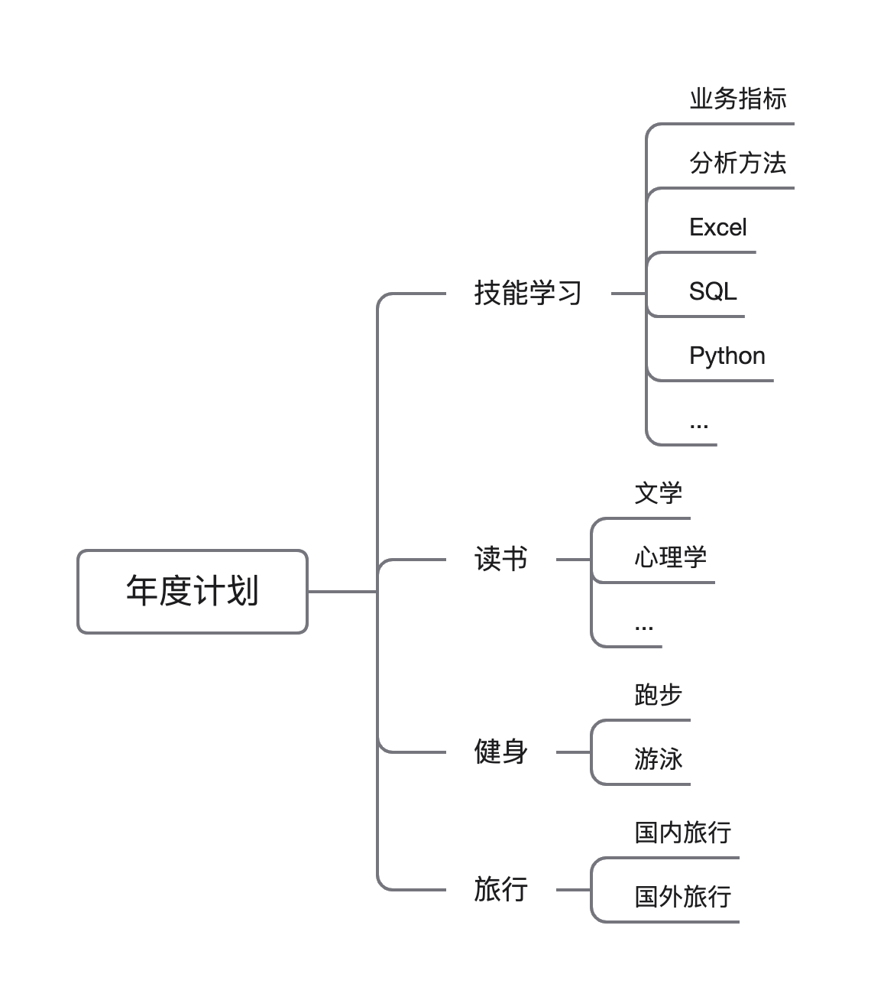
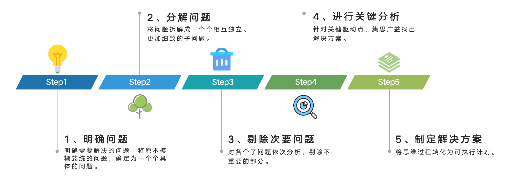

## 什么是逻辑树分析法？

逻辑树分析法，通常是将问题中涵盖的所有子问题，没有疏忽、没有遗漏的进行分层罗列，从最高层向下逐步扩展、逐渐细化，直到最终找到解决问题的方法。

其本质是，**把复杂问题拆解成简单子问题**。

## 逻辑树分析法的作用是什么？

（1）复杂问题简单化，帮助我们理清思路。

（2）找出问题所有相关项，确保问题完整性。

（3）减少重复与无关思考，提升效率。

## 如何使用逻辑树分析法？

不管是生活中还是工作中，我们经常会使用逻辑树分析法来分析问题。

例如，我们给自己制定年度计划，因为要做的事情很多，思路很零散。为了理顺思路，可以使用逻辑树分析法，把年度计划这个复杂问题拆分成技能学习、读书、健身、旅行这几个子问题。

技能学习是为了储备技能，想要零基础学习数据分析，可以进一步拆解为学习业务指标、分析方法、Excel、SQL、Python等。这样一步一步把年度计划拆解成一个一个的子问题，年度学习计划自然就会出来。

逻辑树分析法的操作步骤如下：

step1：明确问题：明确需要解决的问题，将原本模糊笼统的问题，确定为一个个具体的问题。

step2：分解问题：将问题拆解成一个个相互独立、更加细致的子问题。

step3：剔除次要问题：对各个子问题依次分析，剔除不重要的部分。

step4：进行关键分析：针对关键驱动点，集思广益找出解决方案。

step5：制定解决方案：将思维过程转化为可执行计划。

## 逻辑树分析法的经典案例

## 逻辑树分析法使用时的注意事项

逻辑树分析法在解决业务问题时，经常不是单独使用，会融合在其他分析方法里，辅助解决问题。